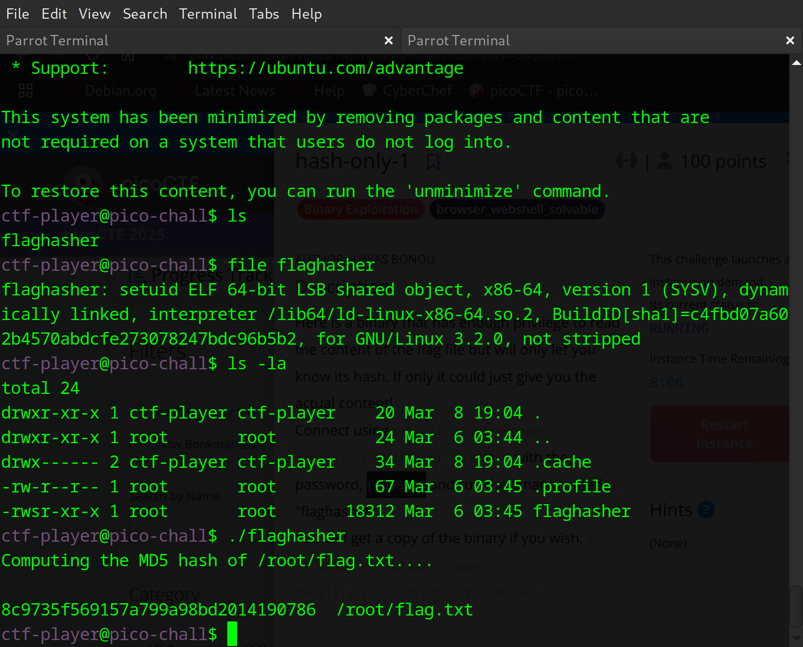
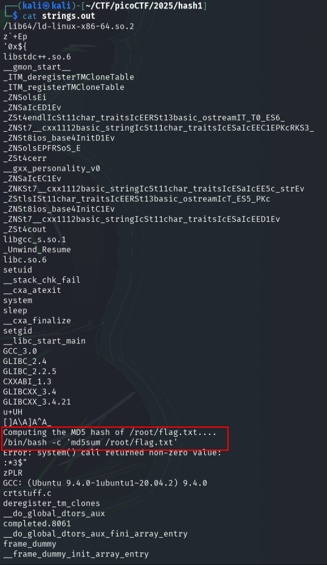
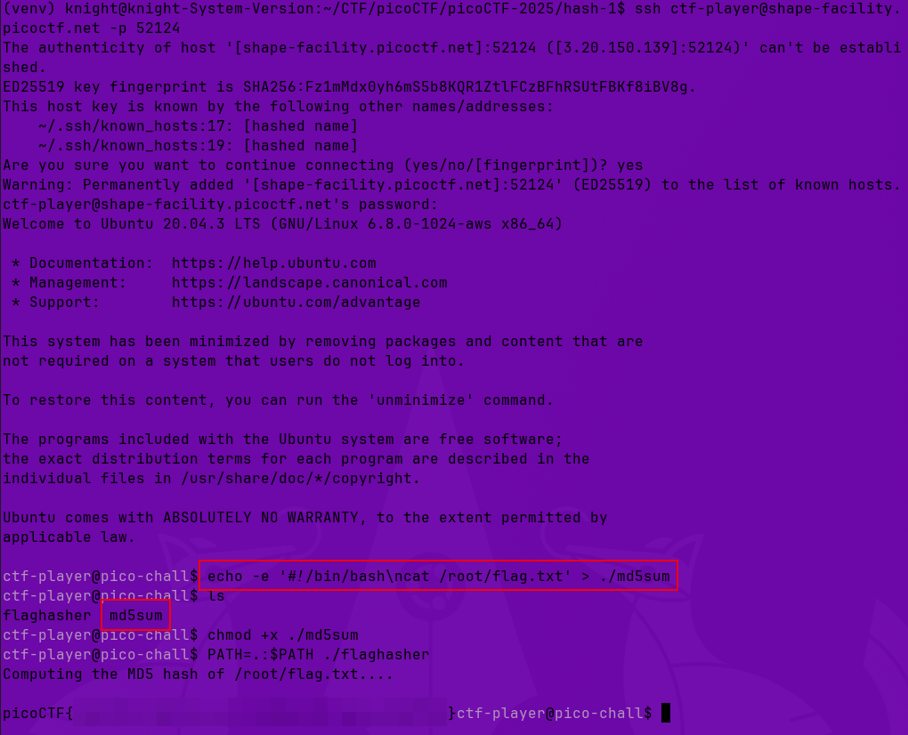

# hash-only-1

**Difficulty**: :fontawesome-solid-star::fontawesome-solid-star::fontawesome-regular-star::fontawesome-regular-star::fontawesome-regular-star:<br/>
**Direct link**: [hash-only-1 binary](./assets/flaghasher)<br/>

## Objective

!!! question "Description"
    Here is a binary that has enough privilege to read the content of the flag file but will only let you know its hash. If only it could just give you the actual content!

## Solution

When the instance is started we get a `ssh` command to connect to the challenge along with a password and instructions to run the binary named "flaghasher". There is also an opportunity to download a copy of the binary using `scp`. I started by using `ssh` to get an idea of what the challenge looks like:


/// caption
Using the `ssh` command and password provided, connect to the service and run the `flaghasher` program. 
///

Running the program produces an md5 hash, presumably of the flag in the expected 'picoCTF{dummy_flag_here}' format. Importantly, the path `root/flag.txt` is provided. Next use `scp` to download the `flaghasher` binary. With the binary downloaded, I used `strings` to begin searching for clues. 

```bash title="Binary Enumeration"
strings flaghasher > strings.out
```

Reviewing the output of the `strings` command, I see first the same text that was seen when we ran the `flaghasher` from `ssh` "Computing the MD5 hash of /root/flag.txt...." Beneath this is the line `/bin/bash -c 'md5sum /root/flag.txt'`


/// caption
Use `strings` to enumerate the binary
///

Lets break this down: `/bin/bash -c 'md5sum /root/flag.txt'`

`/bin/bash`

:   Explicitly calls the Bash shell as the command interpreter

`-c`
    
:   This flag tells Bash to execute the command provided as a string

`'md5sum /root/flag.txt'`
    
:   this is the actual command being executed inside Bash
        
    -   `md5sum` is a command-line utility that calculates the MD5 hash of a file
        
    -   `/root/flag.txt` is the target file whose hash is being calculated.
        
        -   It is significant to note that, typically speaking, reading, writing, or exectuing something from the `/root` directory requires **root** level permission.

Now we know the command that the `flaghasher` program uses, we need to try to change how it happens. If not still connected through `ssh` then reconnect before executing the below commands.

```bash title="Create fake md5sum script"
echo -e '#!/bin/bash\ncat /root/flag.txt' > ./md5sum
chmod +x ./md5sum
```

What this does:

*   `echo -e`:
    *   `echo` prints text to the terminal or redirects it to a file
    *   The `-e` flag enables interpretation of escape sequences
*   `'#!/bin/bash\ncat /root/flag.txt'`
    *   `#!/bin/bash` is a shebang that specifies the script should be executed using Bash
    *   `\n` is a newline character. It causes the next command to appear on a new line
    *   `cat /root/flag.txt` outputs the contents of `/root/flag.txt` to the terminal
*   `> ./md5sum`
    *   The `>` operator redirects the output of `echo` into a file named `md5sum` in the currnt directory
*   `chmod +x ./md5sum` makes the file `md5sum` executable.
        
Next, we'll try to modify the path and run the binary:

```bash title="Run binary with custom path"
PATH=. :$PATH ./flaghasher
```

What does it do?

*   `PATH=.:$PATH`
    *   This modifies the `PATH` environment variable, which determines where the shell looks for executable files
    *   `.` represents the current directory
    *   `:$PATH` appends the existing `PATH` variable
    *   After this modification, when a command is run, the shell will first check the current directory before checking system directories 
*   `./flaghasher` 
    *   explicitly runs the `flaghasher` binary

Now when `flaghasher` executes `md5sum`, the shell checks the current directory first, sees the fake `md5sum` that was created and executes it.


/// caption
Trick the system to do what you want
///

!!! success "Answer"
    Use command injection to retrieve the flag.