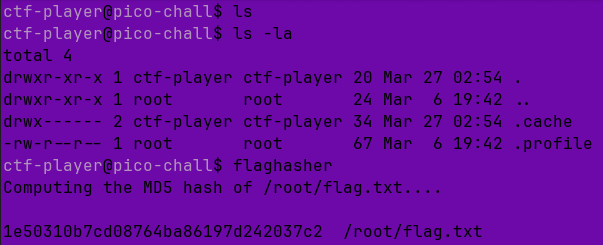
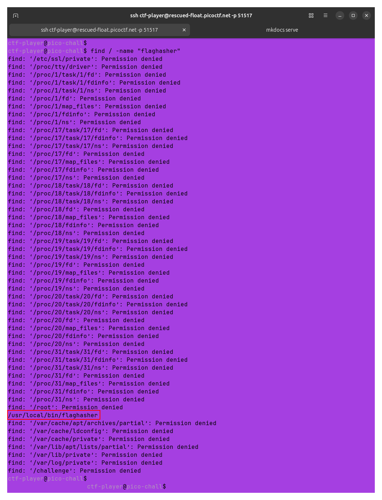
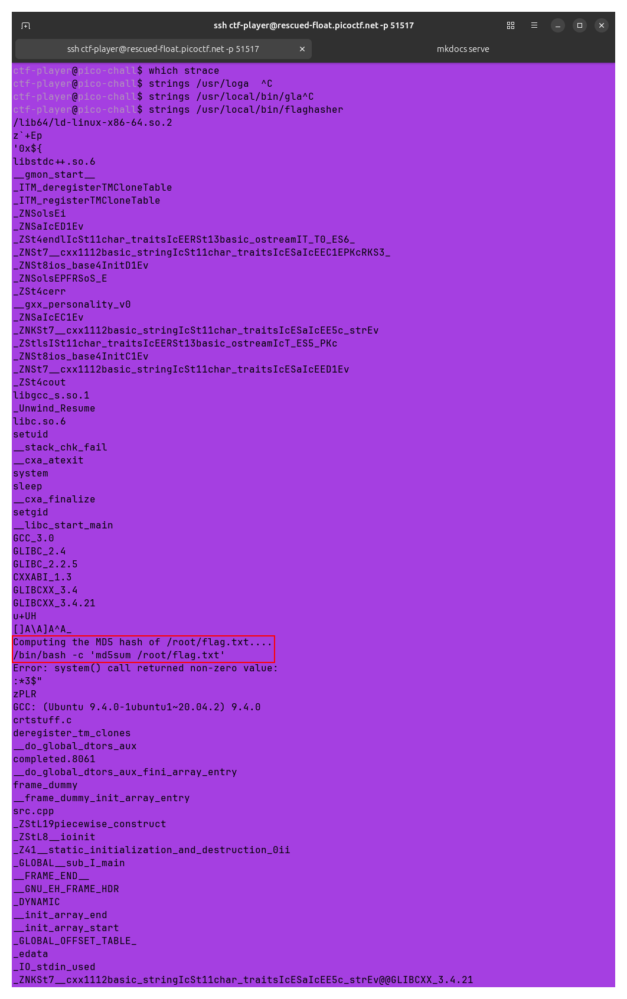
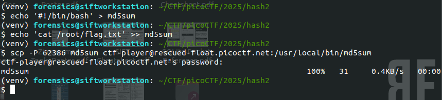
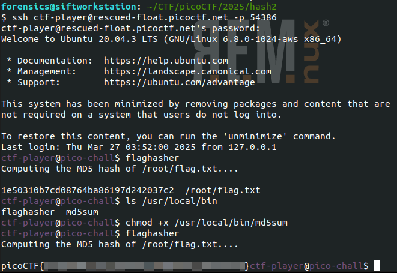

# hash-only-2

**Difficulty**: :fontawesome-solid-star::fontawesome-solid-star::fontawesome-solid-star::fontawesome-regular-star::fontawesome-regular-star: 

## Objective

!!! question "Description"
    Here is a binary that has enough privilege to read the content of the flag file but will only let you know its hash. If only it could just give you the actual content!

## Solution

This challenge starts with the same prompt as [hash-only-1](./o2.md). When the instance is started, we are given an `ssh` command again, with the same instruction to run the binary named "flaghasher". We do not have an `scp` command suggestion this time.  
 
I start by executing the `ssh` command and poking around the terminal. It turns out that `flaghasher` can be executed without being in the same directory this time. I locate the binary, but unsuprisingly am not able to use the same trick this time. Both the `echo` and redirect `>` seem to be blocked. I use the same `strings` command without an output this time and find that the binary appears to be using the same command as the last challenge. 

/// caption
///

/// caption
///

/// caption
///

Without being able to write to a file though, it takes me while to figure out a path forward. In fact, this one required pacing with a rubber duck before eventually I had a lightbulb moment. 
 
Creating the `md5sum` file locally, I then used `scp` to send the file to the target. With the new `md5sum` delivered, I used `ssh` to reconnect, and `chmod` to make it executable, then execute `flaghasher` to retrieve the flag.  

 

!!! success "Answer"
    Use `scp` and command injection to send a malicious file allowing the retrieval of the flag.