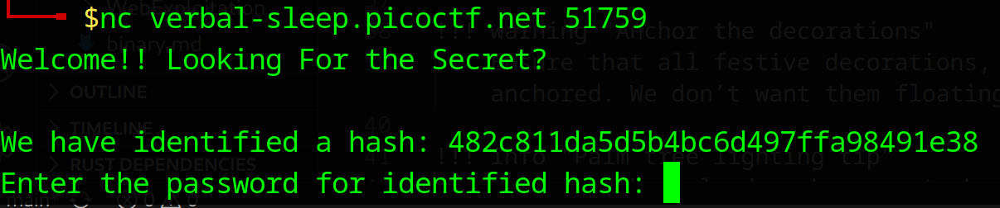
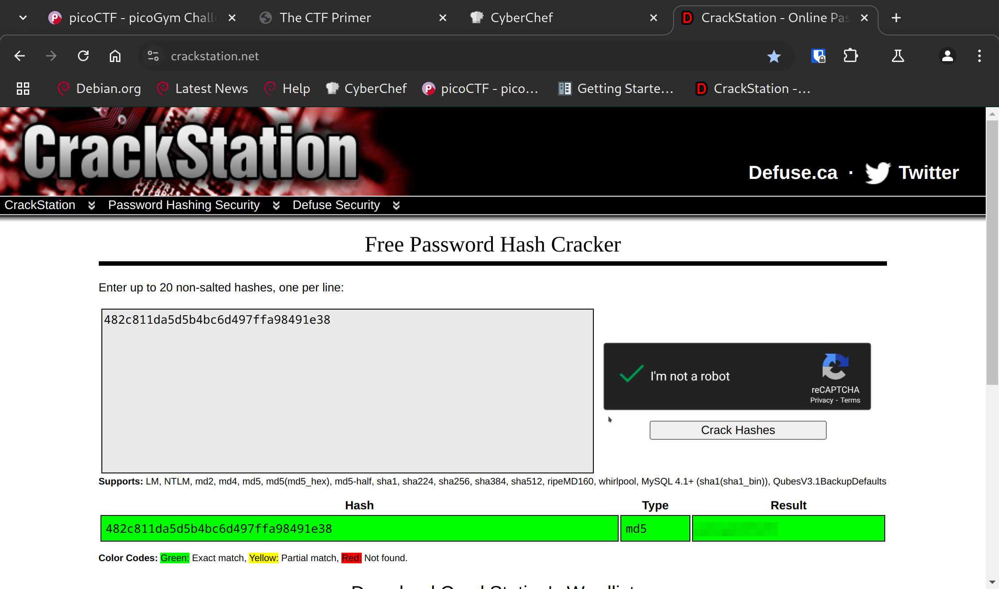
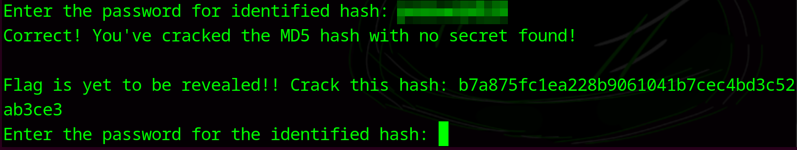
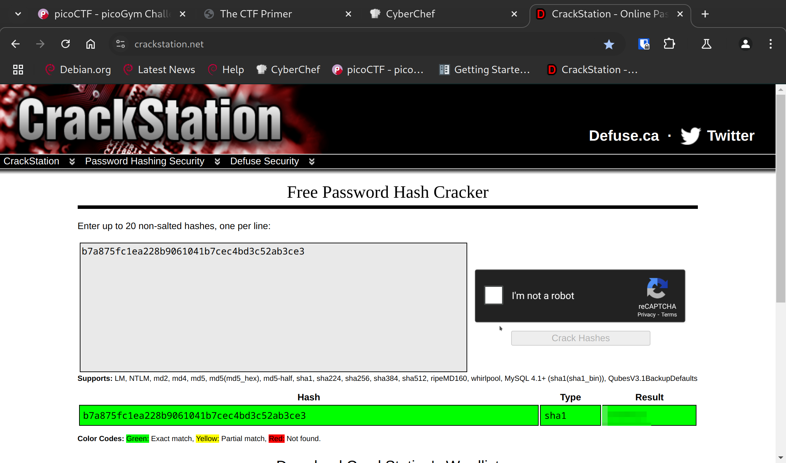
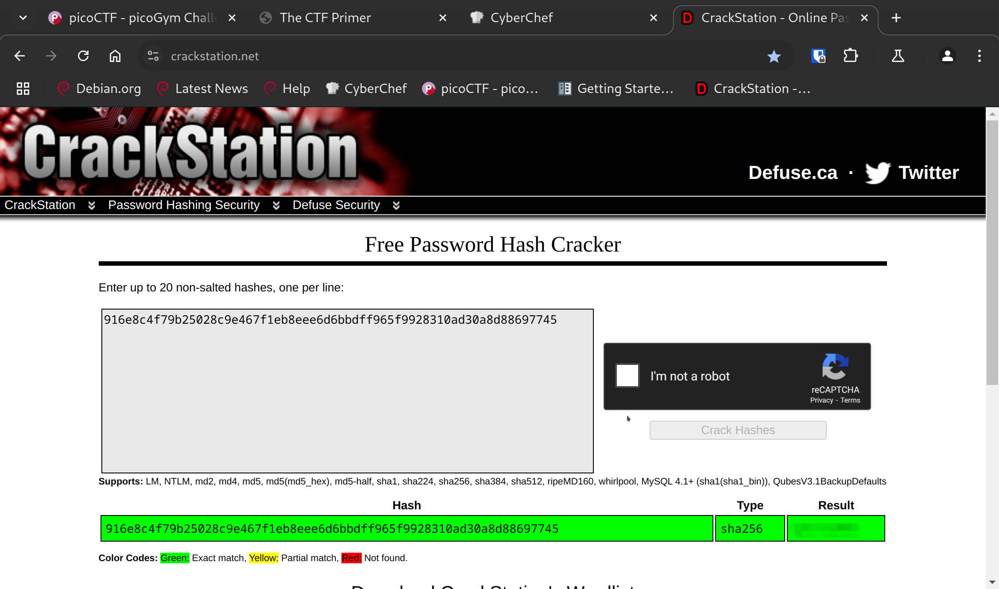
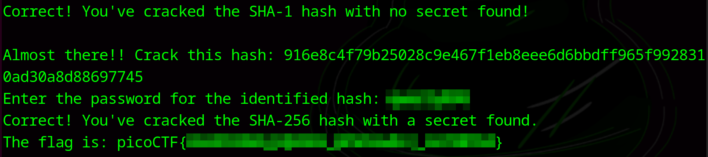

# Insert Objective 1 Title

**Difficulty**: :fontawesome-solid-star::fontawesome-regular-star::fontawesome-regular-star::fontawesome-regular-star::fontawesome-regular-star: 
**Direct link**: `nc verbal-sleep.picoctf.net 51759`

## Objective

!!! question "Description"
    A company stored a secret message on a server which got breached due to the admin using weakly hashed passwords. Can you gain access to the secret stored within the server?

## Hints

??? tip "Hint 1"
    Understanding hashes is very crucial. [Read more here.](https://primer.picoctf.org/#_hashing)

??? tip "Hint 2"
    Can you identify the hash algorithm? Look carefully at the length and structure of each hash identified.

??? tip "Hint 3"
    Tried using any hash cracking tools?

## Solution

This challenge is an introduction to hashing and some of the tools around hashing. If you are unfamiliar with the technology, the pico primer provided in the hints is a great starting point.  
There are a number of tools available for hashcracking such as [JohnTheRipper](https://www.openwall.com/john/) and [hashcat](https://hashcat.net/hashcat/). There are also some invaluable online resources such as [CyberChef](https://cyberchef.org/) and [CrackStation](https://crackstation.net/) that are free to use. 

!!! note inline end "Hashing vs Encryption"
    Hashing and Encryption are both key parts of cybersecurity with distinct purposes and differences. A key factor to remember though is that hashing cannot be reversed. When using tools like [CrackStation](https://crackstation.net/) or `hashcat`, the hacker is comparing the exfiltrated hash to a list of known words using the same hashing algorithm. Read more about the differences [here](https://www.geeksforgeeks.org/difference-between-hashing-and-encryption/)

To start the challenge, type or paste the `netcat` command into a terminal. 

/// caption
A hash and password entry field
///

I started with just pasting the hash into [CrackStation](https://crackstation.net/).

/// caption
Tools like CrackStation are great for low overhead cracking
///

The result tells us the type  of hashing method, in this case the notoriusly insecure MD5, and the password. We can paste or type that password in our terminal to get the next prompt:

/// caption
///

We can use the same method for the revealed hash, which turns out to be SHA1, another hashing method that has been largely phased out. 

/// caption
Grab the password and put it in your terminal
///

Continuing through the prompts, we get a SHA256 hash for the final challenge. This one is also available through [CrackStation](https://crackstation.net/).

/// caption
Hashes are really only secure if the passwords they hash are unique
///

When put into the terminal, we finally get the flag.

/// caption
Success
///

!!! success "Answer"
    Use online cracking tools to find the hashed passwords.
