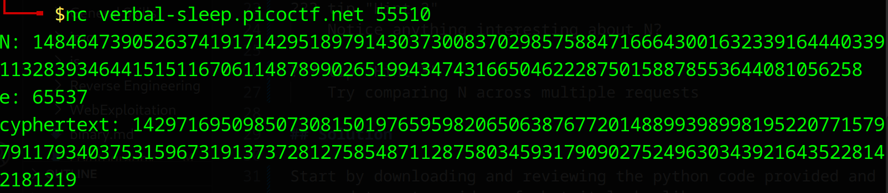
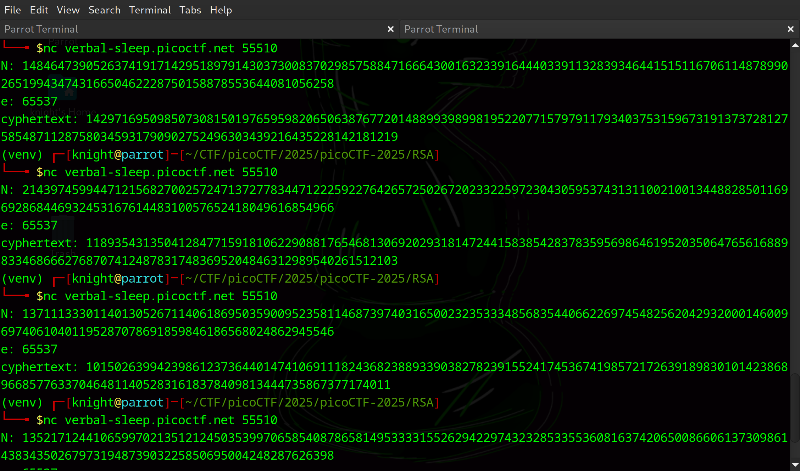

# EVEN RSA CAN BE BROKEN???

**Difficulty**: :fontawesome-solid-star::fontawesome-solid-star::fontawesome-regular-star::fontawesome-regular-star::fontawesome-regular-star:<br/>
**Source Code**: [RSA](./assets/encrypt.py)

## Objective

!!! question "Description"
    This service provides you an encrypted flag. Can you decrypt it with just N & e?

!!! note "Connect"
    Connect to the program with netcat: `nc verbal-sleep.picoctf.net 55510`

## Hints

??? tip "Hint 1"
    How much do we trust randomness?

??? tip "Hint 2"
    Notice anything interesting about N?

??? tip "Hint 3"
    Try comparing N across multiple requests

## Solution

Start by downloading and reviewing the python code provided and run the `netcat` command to get an idea of what it looks like. 


/// caption
Running the command gives us the N, e, and cyphertext
///

We now have N, e, and the cyphertext, presumably in the form of picoCTF{some_flag}. Following the hints, repeat the command a few times to get multiple samples of N. 


/// caption
Use the samples to help
///

With the clues given about radmoness and `N` we can hypothesis that the code being used is generating shared primes. If the code reuses the same prime numbers across multiple key generations, it can be possible to find a shared common prime factor accross different `N`. If two `N` values share a prime factor, it's possible to determine the prime factor with the greatest common divisor. <br/> 
<br/>
After obtaining multiple `N` values, we need to calculate the GCD. To calculate the GCD of two relatively small numbers you can write a script that looks like this:

```python title="GCD" linenums="1"
def gcd(a, b):
    result = min(a, b)

    while result:
        if a % result == 0 and b % result == 0:
            break
        result -= 1
    return result

if __name__ == '__main__':
    N1 = # insert first number
    N2 = # insert second number
    print(f"GCD of {N1} and {N2} is {gcd(a, b)}")
```

!!! tip "Don't reinvent the wheel"
    Python has libraries that you can use that are highly recommended for calculating large numbers efficiently. Specifically, the `gmpy2` library but the python math library is also an option. While it is useful to understand how it works, there is no need to write the code if it already exists. 

When the shared prime (`p`) is determined, it can be used to find the other prime factors (`q1` and `q2`) by dividing `N1` and `N2` by `p`. We'll use the found prime factors to calculate the private exponent `d`:

    *   `phi = (p - 1) * (q - 1)`
    *   `d = inverse(e, phi)`

The private exponent `d` enables us to decrypt via: `plaintext = pow(ciphertext, d, N)`.<br/>

Putting all the parts together, I used a script that connected to the `netcat` service, gathered multiple `N` values and decrypted the ciphertext.<br/>

```python title="solve.py" linenums="1"
import socket
from Crypto.Util.number import long_to_bytes, inverse
import gmpy2

def solve_rsa(N1, N2, ciphertext):
    p = gmpy2.gcd(N1, N2)  
    if p > 1:
        q = N1 // p
        phi = (p - 1) * (q - 1)
        d = inverse(65537, phi)
        plaintext = pow(ciphertext, d, N1)
        return long_to_bytes(plaintext).decode()
    else:
        return None

def get_data_from_server():
    host = "verbal-sleep.picoctf.net"
    port = 55510

    try:
        with socket.create_connection((host, port)) as s:
            data = s.recv(4096).decode()
            n_line = data.split('N: ')[1].split('\n')[0]
            cypher_line = data.split('cyphertext: ')[1].split('\n')[0]
            N = int(n_line)
            ciphertext = int(cypher_line)
            return N, ciphertext
    except Exception as e:
        print(f"Error connecting to server: {e}")
        return None, None

def main():
    n_values = []
    cypher_values = []

    for _ in range(3): # get 3 values, just to be sure.
        N, ciphertext = get_data_from_server()
        if N is None or ciphertext is None:
            return
        n_values.append(N)
        cypher_values.append(ciphertext)

    for i in range(len(n_values)):
        for j in range(i + 1, len(n_values)):
            flag = solve_rsa(n_values[i], n_values[j], cypher_values[i])
            if flag:
                print("Flag:", flag)
                return

    print("Failed to find shared prime.")

if __name__ == "__main__":
    main() 
``` 

!!! note "Dependencies"
    If using this code, first run `pip install pycryptodome` & `pip install gmpy2`


!!! success "Answer"
    Compare multiple `N` value to determne the shared prime and crack the ciphertext
