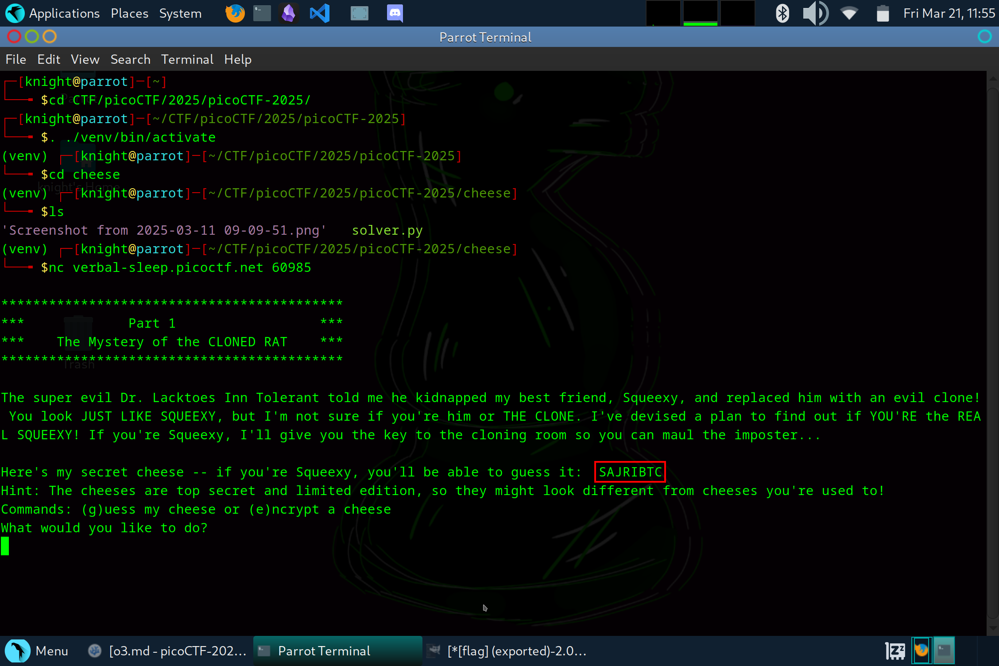
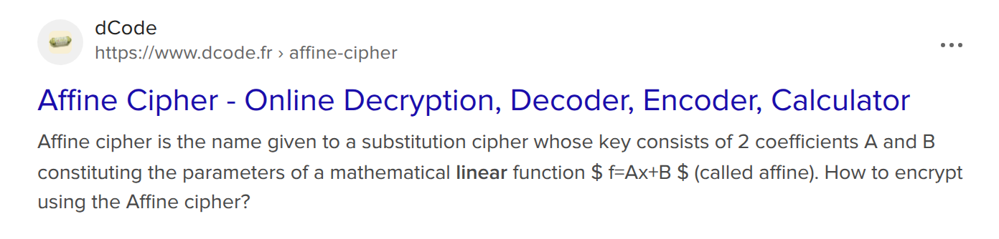
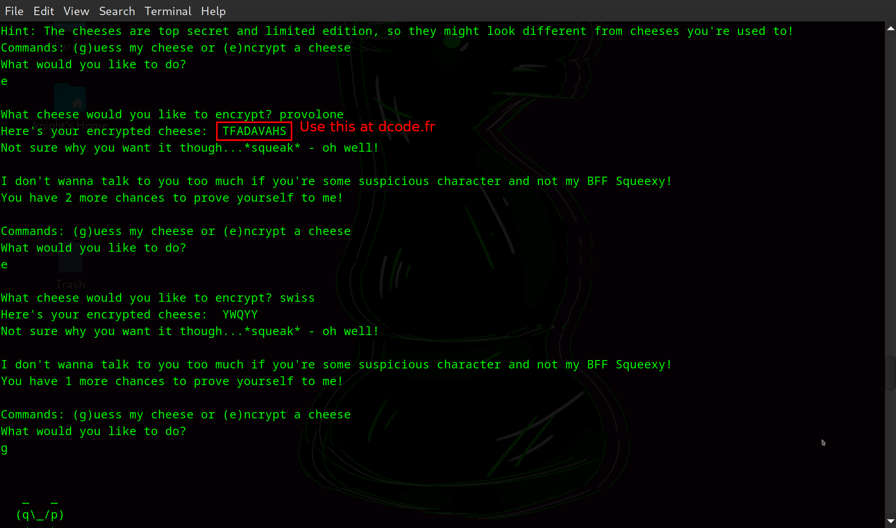
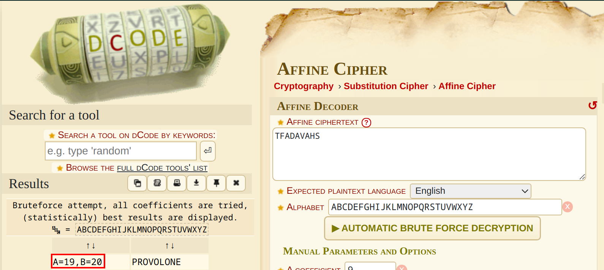
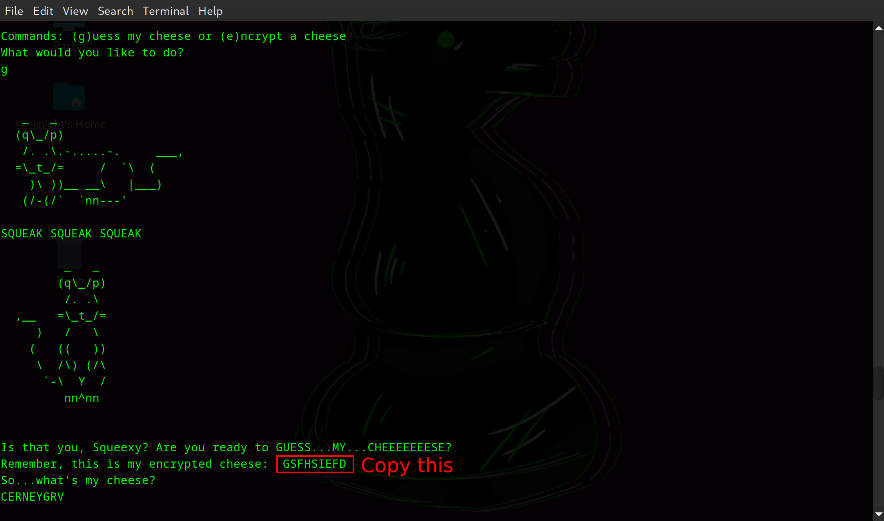
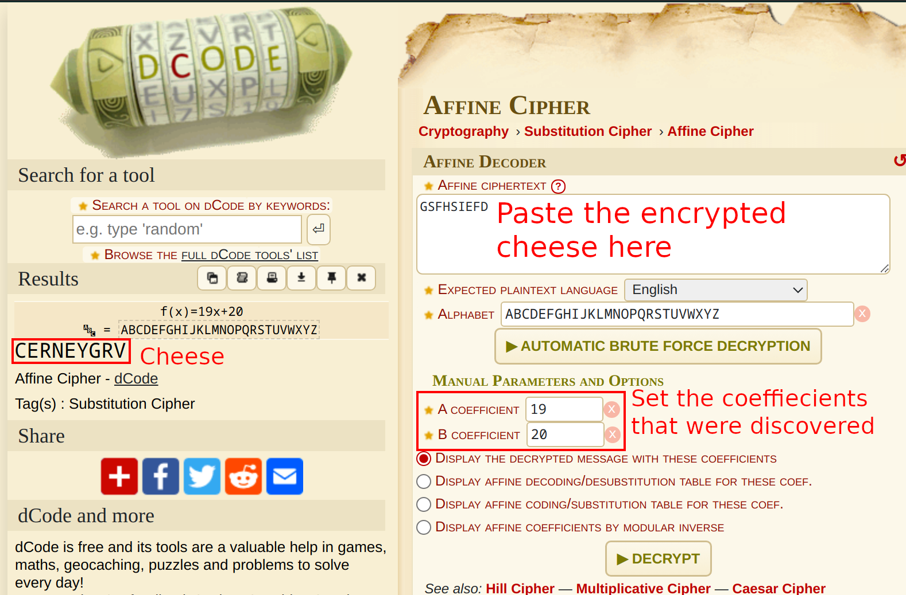
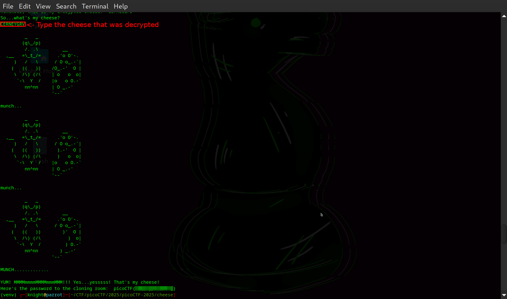

# Guess My Cheese (Part 1)

**Difficulty**: :fontawesome-solid-star::fontawesome-solid-star::fontawesome-regular-star::fontawesome-regular-star::fontawesome-regular-star: 
**Direct connect**: `nc verbal-sleep.picoctf.net 60985`

## Objective

!!! question "Description"
    Try to decrypt the secret cheese password to prove you're not the imposter!

## Hints

??? tip "Hint 1"
    Remember that cipher we devised together Squeexy? The one that incorporates your affinity for linear equations???

## Solution

We start with the terminal for this challenge; connect to the service with `netcat`.

/// caption
Initiate the service to see our story prompt
///

We get a little blurb about "evil Dr. Lacktoes Inn Tolerant" and his diabolical plot of mice cloning along with an encoded message. Next, there is a prompt with options to `(g)uess or (e)ncrypt`.  
 
If you are familiar with the various forms of encryption and ciphers, you may have picked up on the clue in the hint. If not, a quick online search will help put together an "affinity for linear equations" with an [Affine Cipher](https://en.wikipedia.org/wiki/Affine_cipher). 

/// caption
Quick online search shows a number of references to Affine Cipher
///

The site [dCode](https://www.dcode.fr/), like the online tool [CrackStation](https://crackstation.net/) used in the [hashcrack](./o1.md) challenge, is a invaluable, free online resource that is really useful to have bookmarked. Let's just copy and paste the encoded message from the terminal to the [Affine Cipher](https://www.dcode.fr/affine-cipher) and see what we get. The Affine Cipher is a type of substitution cipher, which means that it can be potentially brute force cracked by trying every/multiple variations. If we know the encryption key that is used, we can use it to decrypt a given ciphertext. Since the service allows us to encrypt a word (as long as it is a cheese), we can take the encrypted text, plug it into the bruteforce decoder and then apply the calculated keys to the encrypted cheese. 

    

!!! success "Answer"
    1.  Connect to the service with `netcat`
    2.  Encrypt a known cheese (PROVOLONE, SWISS, MOZZARELLA)
    3.  Use a tool such as [dcode.fr](https://www.dcode.fr/affine-cipher) to bruteforce the `A` & `B` coefficient
    4.  Use the coefficients found to decrypt the secret cheese manually on the same site
