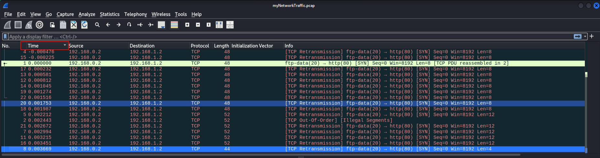
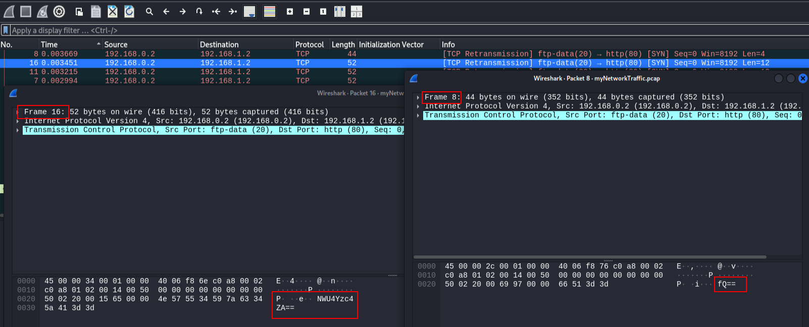
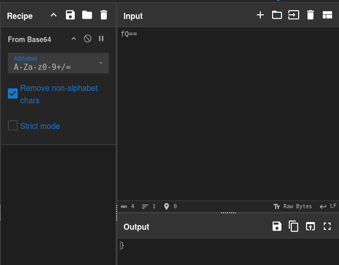
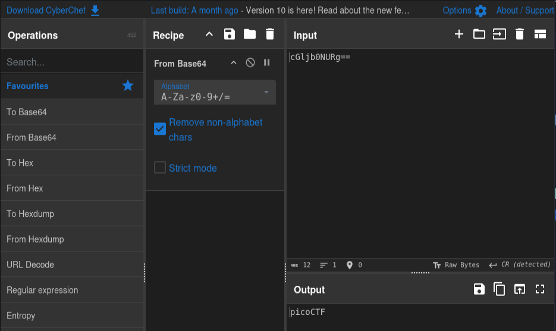
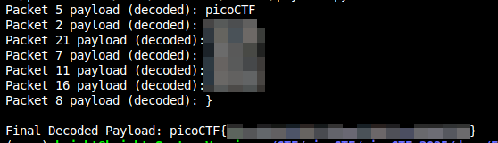

# Ph4nt0m 1ntrud3r

**Difficulty**: :fontawesome-solid-star::fontawesome-regular-star::fontawesome-regular-star::fontawesome-regular-star::fontawesome-regular-star:<br/>
**Direct link**: [Network Traffic PCAP file](./assets/myNetworkTraffic.pcap)<br/>

## Objective

!!! question "Description"
    A digital ghost has breached my defenses, and my sensitive data has been stolen! 😱💻 Your mission is to uncover how this phantom intruder infiltrated my system and retrieve the hidden flag. To solve this challenge, you'll need to analyze the provided PCAP file and track down the attack method. The attacker has cleverly concealed his moves in well timely manner. Dive into the network traffic, apply the right filters and show off your forensic prowess and unmask the digital intruder!

## Hints

??? tip "Hint 1"
    Filter your packets to narrow down your search.

??? tip "Hint 2"
    Attacks were done in timely manner.

??? tip "Hint 3"
    Time is essential

## Solution

This challenge gives us a PCAP file to examine with 22 packets. The clues are minimal; the first suggesting narrowing the search by filtering, and the last two hinting at "time". So to start, just filter the packets by the "Time" field by clicking the header. 


/// caption
Sort by time
///

The next thing I did was just open the packets and look at the payloads. I was looking for any patterns or something that jumped out. What I noticed was that the oldest packets, almost all equaling a length of 12, looked really similar to Base64. 


/// caption
Watching for patterns, this looks familiar
///

When I pasted the last packt, or first packet, depending on how you filter the time, I was convinced I was on the right track.


/// caption
My hunch was right; the last packet contains a bracket in Base64 encoding
///

With this information it was apparent that the flag was encoded in base64 across multiple packets. It looked to me like the packets with a len of 12 were the packets with the Base64 encoding. I grabbed the first payload of that group of packets and verified with [CyberChef](https://gchq.github.io/CyberChef/#recipe=From_Base64('A-Za-z0-9%2B/%3D',true,false)&ieol=CR&oeol=CR)


/// caption
Now I just need to put it together
///

I know which packets have the flag; I probably know the order that they need to be used (based on time), and I know how the payloads are encoded. I use this to write a script to decode and assemble the full flag:

```python title="phantom solve.py" linenums="1"
from scapy.all import *
import base64

packets = rdpcap("myNetworkTraffic.pcap")
packet_numbers = [5, 2, 21, 7, 11, 16, 8]

decoded_payloads = []
for i in packet_numbers:
    packet = packets[i-1]
    if Raw in packet:
        payload = packet[Raw].load
        try:
            decoded = base64.b64decode(payload).decode('utf-8', errors='replace')
            decoded_payloads.append(decoded)
            print(f"Packet {i} payload (decoded): {decoded}")
        except Exception as e:
            print(f"Error decoding payload from packet {i}: {e}")

# Concatenate all decoded payloads
final_payload = ''.join(decoded_payloads)
print("\nFinal Decoded Payload:", final_payload)
```


/// caption
This was easier than doing it by hand, but both are valid options
///

!!! success "Answer"
    Assemble the correct payloads in the correct order to determine the flag. 