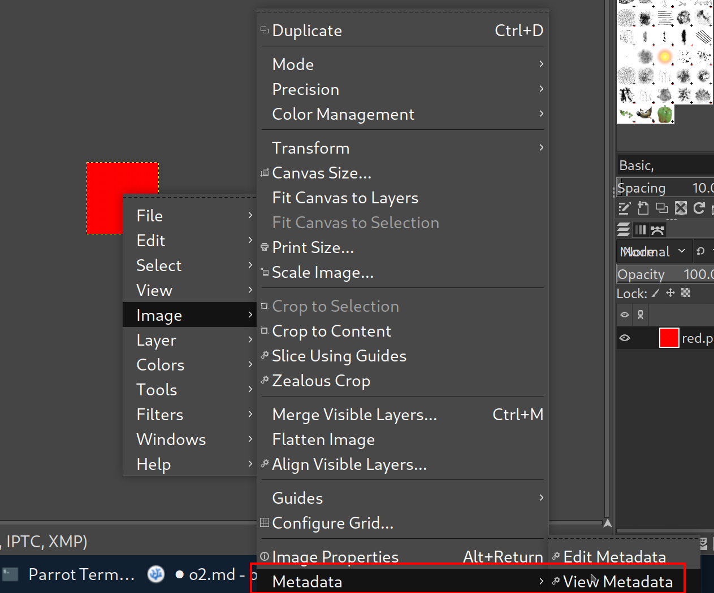
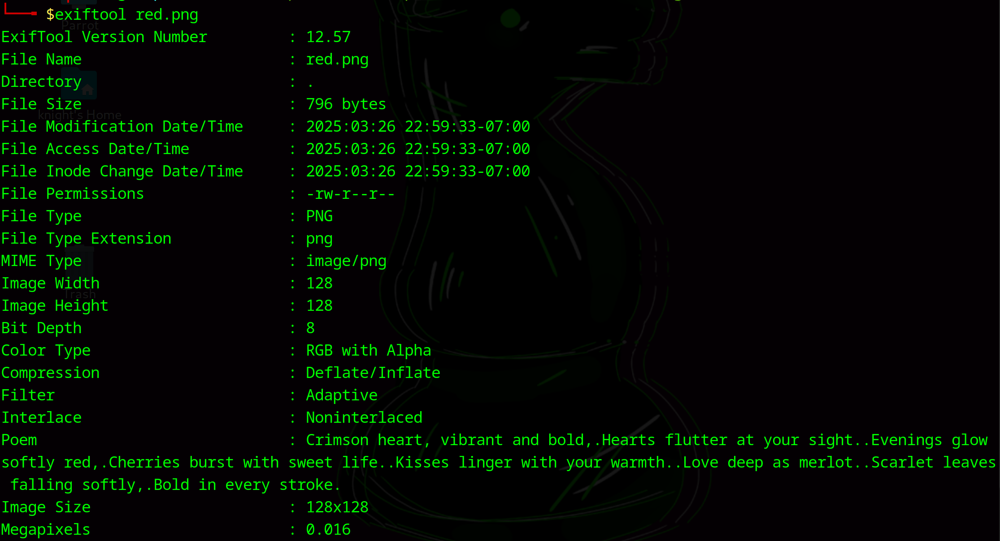
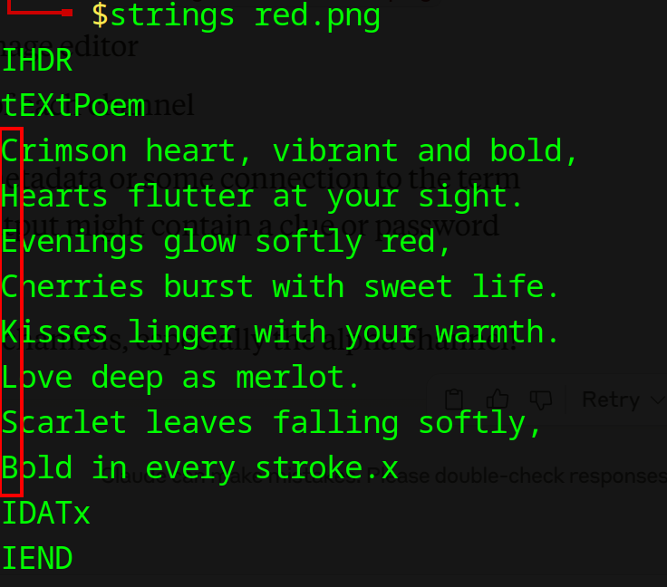

# RED

**Difficulty**: :fontawesome-solid-star::fontawesome-regular-star::fontawesome-regular-star::fontawesome-regular-star::fontawesome-regular-star:<br/>
**Direct link**: <br/>

## Objective

!!! question "Description"
    RED, RED, RED, RED

## Hints

??? tip "Hint 1"
    The picture seems pure, but is it though?

??? tip "Hint 2"
    Red?Ged?Bed?Aed?

??? tip "Hint 3"
    Check whatever Facebook is called now.

## Solution

The challenge gives very little in the way of a description. Obviously, the file needs to be examined so download it to begin with. I started with `exiftool` and *GIMP (GNU Image Manipulation Program)*.


/// caption
As I was exploring the options, this menu provided insight into the "Facebook" clue 
///


/// caption
Only the poem seems to be out of the ordinary
///

Using `exiftool` shows us the poem, but it doesn't seems to make much sense to me. I spent time extracting the various channels and trying to find the hidden message (because there has to be a hidden message). I eventually ran `strings` on the image and that finally revealed a new clue.


/// caption
Strings presents a specific format that was helpful
/// 

After running `strings red.jpg`, the poem was finally presented in such a way that the first character of each line was a capital character and spelled C-H-E-C-K-L-S-B. Check LSB!<br/>
<br/>
LSB, or Least Significant Bit, is the last bit of a binary integer. Given the other clues, I thought the glag might be split between the LSB of the different channels. I wrote a script using Python to extract the LSB of each channel and convert it to ASCII to see if there was anything hidden. <br/>

```python title="extract_lsb.py" linenums="1"
from PIL import Image

def extract_lsb(image_path):
    img = Image.open(image_path)
    pixels = list(img.getdata())
    
    # For RGBA image
    binary_result = ""
    for pixel in pixels:
        # Extract LSB from each channel (R,G,B,A)
        for channel_value in pixel:
            binary_result += str(channel_value & 1)  # Get LSB
    
    # Convert binary to ASCII (8 bits per character)
    result = ""
    for i in range(0, len(binary_result), 8):
        if i + 8 <= len(binary_result):
            byte = binary_result[i:i+8]
            result += chr(int(byte, 2))
    
    return result

# Extract and print the hidden data
hidden_data = extract_lsb("red.png")
print(hidden_data)
```

The script gives a base64 string that can be decoded using CyberChef (or added to the code if you want to adjust it) for the flag.

!!! success "Answer"
    Inspect the LSB of the channels to find the hidden flag.
