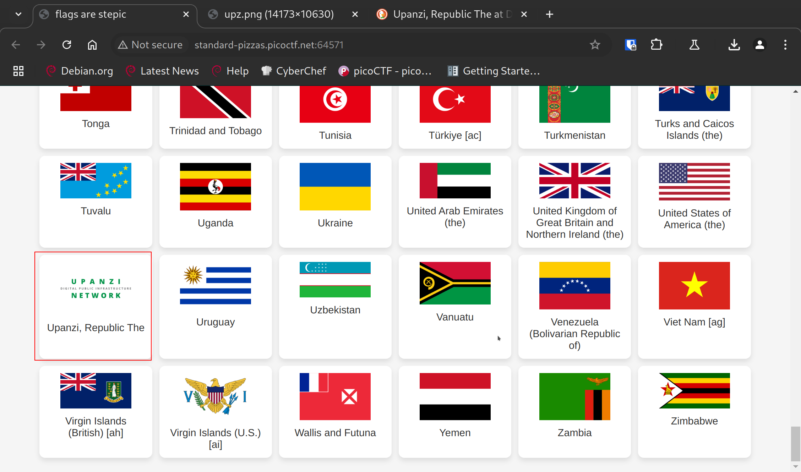
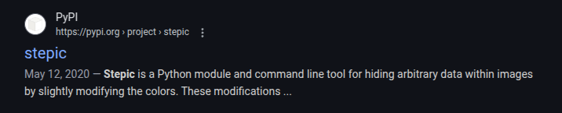

# flags are stepic

**Difficulty**: :fontawesome-solid-star::fontawesome-solid-star::fontawesome-regular-star::fontawesome-regular-star::fontawesome-regular-star:<br/>
**Direct link**: [Objective 3 terminal](https://.../)

## Objective

!!! question "Description"
    A group of underground hackers might be using this legit site to communicate. Use your forensic techniques to uncover their message.

## Hints

??? tip "Hint 1"
    In the country that doesn't exist, the flag persists

## Solution

Start the instance and nagigate to the site that is provided. When you are there, it's a page of various flags. As far as I can tell, all of the flags were legitimate national flags with the exception of our target. 


/// caption
The page appears to be a list of flags
///

Scrolling through the page, none of the flags appear to be interactive so the hidden inforamation has to be somewhere else. When I scrolled through the flags testing for operability, I found what I thought to be an interesting flag:


/// caption
That's odd looking...
///

"Upanzi" looks like an fake flag to me; especially the design. Lets look it up.


/// caption
Google the 'network'
///

Looks like I'm on the right track. With this information, I downloaded the image and then did a google search for the title 'stepic' to find out that it is a Python module for "hiding arbitrary data"


/// caption
This is likely how the image is being modified
///

I wrote a basic script using `stepic` to try retrieving any hidden messages:

```python title="extract.py" linenums="1"
import stepic
from PIL import Image

img = Image.open('upz.png')
data = stepic.decode(img)
print(data)
```

Looks like that works!

!!! success "Answer"
    Find the fake flag and use `stepic` to extract the hidden flag