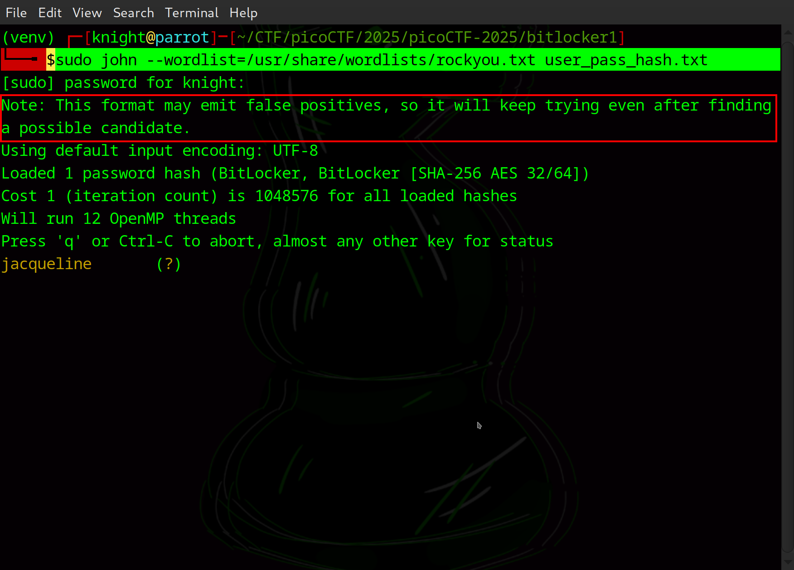
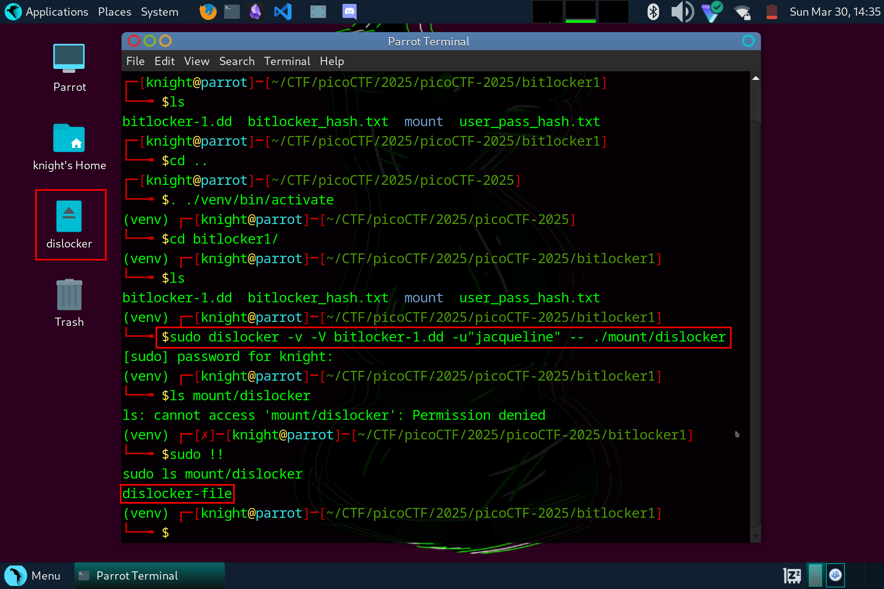
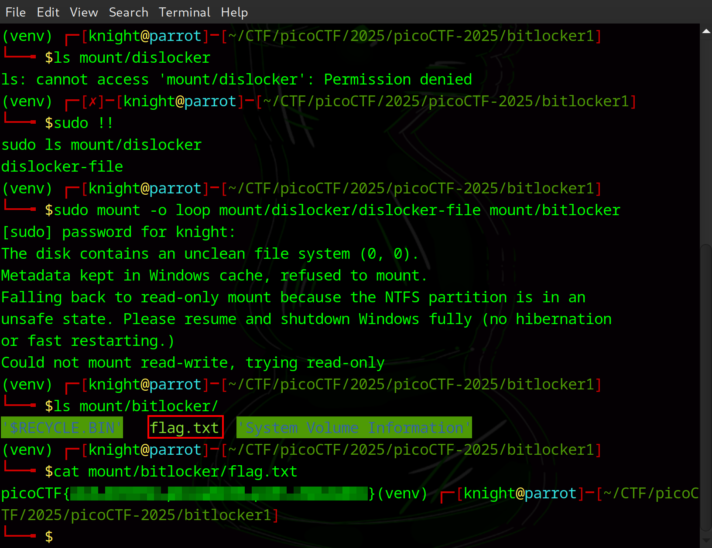

# Bitlocker-1

**Difficulty**: :fontawesome-solid-star::fontawesome-solid-star::fontawesome-solid-star::fontawesome-regular-star::fontawesome-regular-star:<br/>

## Objective

!!! question "Description"
    Jacky is not very knowledgable about the best security passwords and used a simple password to encrypt their BitLocker drive. See if you can break through the encryption!

## Hints

??? tip "Hint 1"
    Hash cracking

## Solution

Well, we have a disk image that needs to be downloaded and a hint about hash cracking. We also have the title **Bitlocker**, which tells us a little about what to expect. BitLocker is a Windows security feature that encrypts data on a drive and can be used for entire volumes. The `.dd` is the encrypted drive. The goals for this challenge will be to extract the BitLocker recovery information, get the hash, and then break the hash. <br/>
<br/>
There are tools specifically for these scenarios. One of the most popular cracking tools is [John the Ripper](https://en.wikipedia.org/wiki/John_the_Ripper) which has a module called `bitlocker2john`. Use `#!bash sudo bitlocker2john -i bitlocker-1.dd > bitlocker_hash.txt` to extract BitLocker information and save it to a text file for review. Open the result with `cat bitlocker_hash.txt` or use a text editor. You should see something similar to below.

```bash title="bitlocker_hash.txt" linenums="1"
Encrypted device bitlocker-1.dd opened, size 100MB
Salt: 2b71884a0ef66f0b9de049a82a39d15b
RP Nonce: 00be8a46ead6da0106000000
RP MAC: a28f1a60db3e3fe4049a821c3aea5e4b
RP VMK: a1957baea68cd29488c0f3f6efcd4689e43f8ba3120a33048b2ef2c9702e298e4c260743126ec8bd29bc6d58

UP Nonce: d04d9c58eed6da010a000000
UP MAC: 68156e51e53f0a01c076a32ba2b2999a
UP VMK: fffce8530fbe5d84b4c19ac71f6c79375b87d40c2d871ed2b7b5559d71ba31b6779c6f41412fd6869442d66d

User Password hash:
$bitlocker$0$16$cb4809fe9628471a411f8380e0f668db$1048576$12$d04d9c58eed6da010a000000$60$68156e51e53f0a01c076a32ba2b2999afffce8530fbe5d84b4c19ac71f6c79375b87d40c2d871ed2b7b5559d71ba31b6779c6f41412fd6869442d66d
Hash type: User Password with MAC verification (slower solution, no false positives)
$bitlocker$1$16$cb4809fe9628471a411f8380e0f668db$1048576$12$d04d9c58eed6da010a000000$60$68156e51e53f0a01c076a32ba2b2999afffce8530fbe5d84b4c19ac71f6c79375b87d40c2d871ed2b7b5559d71ba31b6779c6f41412fd6869442d66d
Hash type: Recovery Password fast attack
$bitlocker$2$16$2b71884a0ef66f0b9de049a82a39d15b$1048576$12$00be8a46ead6da0106000000$60$a28f1a60db3e3fe4049a821c3aea5e4ba1957baea68cd29488c0f3f6efcd4689e43f8ba3120a33048b2ef2c9702e298e4c260743126ec8bd29bc6d58
Hash type: Recovery Password with MAC verification (slower solution, no false positives)
$bitlocker$3$16$2b71884a0ef66f0b9de049a82a39d15b$1048576$12$00be8a46ead6da0106000000$60$a28f1a60db3e3fe4049a821c3aea5e4ba1957baea68cd29488c0f3f6efcd4689e43f8ba3120a33048b2ef2c9702e298e4c260743126ec8bd29bc6d58
```

Lets cover what this means. 

    1.  **Salt: 2b71884a0ef66f0b9de049a82a39d15b**
        *   Salt used in the key derivation funtion when hashing the recovery password
    2.  **RP Nonce: 00be8a46ead6da0106000000**
        *   Nonce associate with the Recovery Password. 
    3.  **RP MAC: a28f1a60db3e3fe4049a821c3aea5e4b**
        *   The Message Authentication Code for the Recovery Password.
    4.  **RP VMK: a1957baea68cd29488c0f3f6efcd4689e43f8ba3120a33048b2ef2c9702e298e4c260743126ec8bd29bc6d58**
        *   The Volume Master Key associated with the recovery password
    5.  **UP Nonce: d04d9c58eed6da010a000000**
        *   The Nonce associated with the User Password
    6.  UP MAC: 68156e51e53f0a01c076a32ba2b2999a
        *   The Message Authentication Code for the User Password
    7.  UP VMK: fffce8530fbe5d84b4c19ac71f6c79375b87d40c2d871ed2b7b5559d71ba31b6779c6f41412fd6869442d66d
        *   The Volume Master Key that is associated with the user password
    8.  User Password hash:
        *   Contains the hash extracted for the User Password, formatted for use with John the Ripper
    
    9. - 11.    3 different hash types.

!!! note "JohnTheRipper"
    If you are using an operating system like Kali Linux or ParrotOS then JohnTheRipper is likely already installed. If you are using an operating system that is not necessarily geared towards security, you can use `sudo apt install john` to get the latest version.

We need the User Password Hash to attempt to crack the password. Highlight and copy the line that begins with `$bitlocker$0` then use `echo` or open a text editor and paste the full line into a document called `user_pass_hash.txt`. We can then use John the Ripper and a basic wordlist such as the rockyou.txt. 

```bash title="John the Ripper"
sudo john --wordlist=/usr/share/wordlists/rockyou.txt user_pass_hash.txt
```

!!! note "Wordlist"
    This is my obligatory note about wordlists. If you are unfamiliar with password cracking and wordlists, it is a list of passwords that are used to compare a hash against. Once your program finds a matching hash, the password is known. This is typically a more efficient way to attempt password cracking than to attempt brute-forcing a password. However, a wordlist is only useful if it has the password your target used. There are many various wordlists available; [SecList](https://github.com/danielmiessler/SecLists) is an ideal one. There are also tools for creating custom wordlists which can be useful for narrowing the scope or focusing on specific targets. 


/// caption
This is the first match found
///

The note states: "This format may emit false positives, so it will keep trying even after finding a possible candidate". This means the program will keep going as it is possible that there could be false positives. We aren't really worried about a false positive at this point, so lets assume we cracked Jacky's password. This isn't the end of the challenge though. This password doesn't fit our flag format, so there must be more that is needed. Since we only have an encrypted disk dump available, lets try to mount the `.dd`.<br/>
<br/>
First, install `dislocker` if you don't already have it.<br/>

```bash 
sudo apt install dislocker
```

Next, we need to create a couple of directories. We are going to make a directory named `mount` and then two subdirectories, `dislocker` and `bitlocker`:

```bash
mkdir -p mount/dislocker mount/bitlocker
```

Now we can use `dislocker` to decrypt the drive with the password we found:

```bash
sudo dislocker -v -V bitlocker-1.dd -u"jacqueline" -- ./mount/dislocker
```

-   `sudo dislocker`: Dislocker is a tool used to read BitLocker-encrypted partitions. It needs sudo permissions to run similar John the Ripper.
-   `-v`: This is the "verbose" flag telling `dislocker` to provide more detailed output
-   `-V bitlocker-1.dd`: `-V` specifies the path to the BitLocker-encrypted disk image file
-   `-u"jacqueline"`: `-u` specifies the user password used to unlock the BitLocker volume
-   `-- ./mount/dislocker`: specifies the output file (or mount point) where the decrypted volume will be written. **The mount directory must exist before running this command**


/// caption
The decrypted file will be `dislocker-file`
///

The volume should now be decrypted so that we can mount and navigate it, similar to any other volume. We'll use the below command to mount the volume to the mount point we created above after using `dislocker` to decrypt, then read the file found:<br/>

```bash
sudo mount -o loop mount/dislocker/dislocker-file mount/bitlocker
ls mount/bitlocker
cat mount/bitlocker/flag.txt
```


/// caption
It should mount as read only, giving you unencrypted access to the volume
///

!!! success "Answer"
    Use tools such as John the Ripper and `dislocker` to extract, crack, and use the password to decrypt a BitLocker encrypted volume.