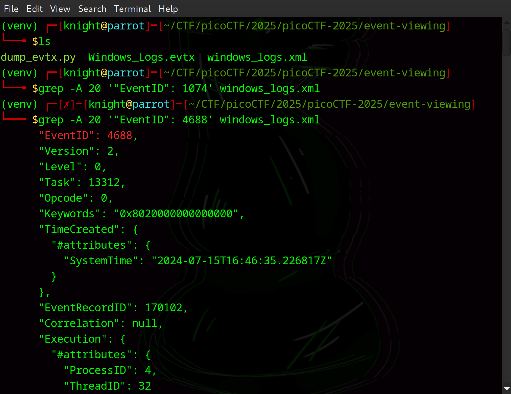
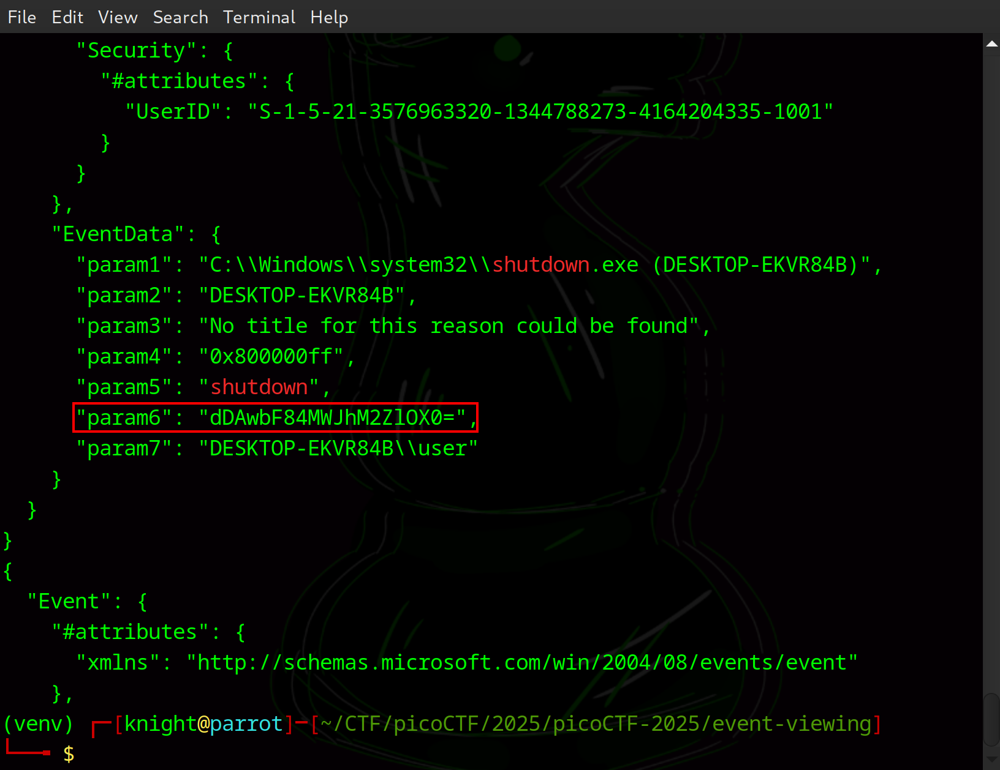
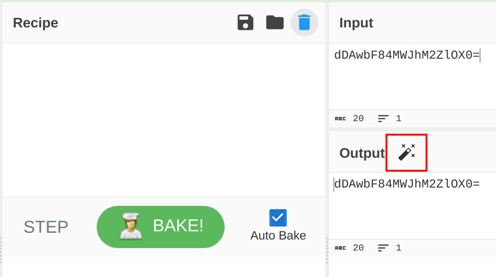
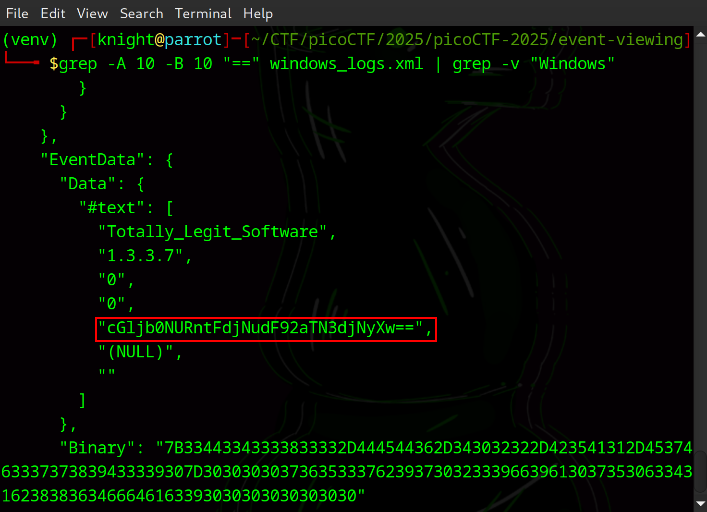
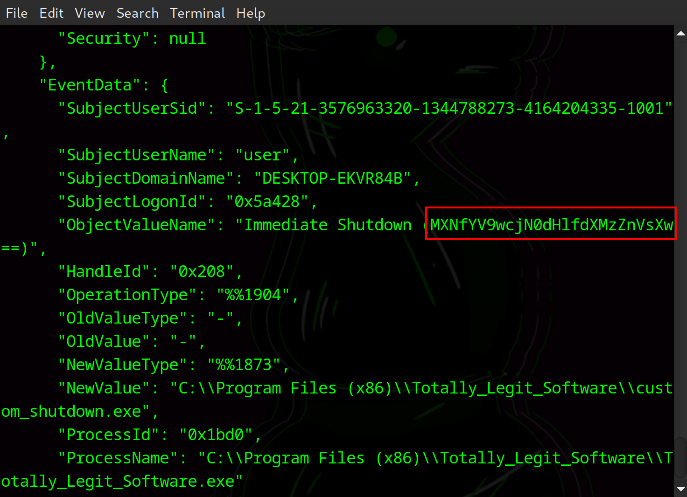

# Event-Viewing

**Difficulty**: :fontawesome-solid-star::fontawesome-solid-star::fontawesome-regular-star::fontawesome-regular-star::fontawesome-regular-star:<br/>
**Direct link**: [Windows Log File](./assets/Windows_Logs.evtx)<br/>

## Objective

!!! question "Description"
    One of the employees at your company has their computer infected by malware! Turns out every time they try to switch on the computer, it shuts down right after they log in. The story given by the employee is as follows:

    1.  They installed software using an installer they downloaded online
    2.  They ran the installed software but it seemed to do nothing
    3.  Now every time they bootup and login to their computer, a black command prompt screen quickly opens and closes and their computer shuts down instantly.
    
    See if you can find evidence for the each of these events and retrieve the flag (split into 3 pieces) from the correct logs!

## Hints

??? tip "Hint 1"
    Try to filter the logs with the right event ID

??? tip "Hint 2"
    What could the software have done when it was ran that causes the shutdowns every time the system starts up?

## Solution

At the time of completing this challenge, I did not have access to the Windows Forensics VM I used for other challenges. The easiest way to explore Windows Event Logs would probably be using a Windows machine but as you'll see here, it is not necessary. After a little research, I was able to install `python-evtx` and write a script to extract convert the `.evtx` to `.xml` for easier searching. 

```python linenums="1" title="dump_evtx.py"
#!/usr/bin/env python3
import sys
from xml.sax.saxutils import escape
from evtx import PyEvtxParser

def main():
    parser = PyEvtxParser(sys.argv[1])
    print('<?xml version="1.0" encoding="utf-8" standalone="yes" ?>')
    print('<Events>')
    for record in parser.records_json():
        print(record['data'])
    print('</Events>')

if __name__ == '__main__':
    main()
```

```bash 
# make the script executable
chmod +x dump_evtx.py
# execute script
./dump_evtx.py Windows_Logs.evtx > windows_logs.xml
```

Now I can search the `windows_logs.xml` using `grep` to begin investigating the logs.<br/>
Looking at the description, I first attempted various searches based on different Event IDs I thought might be relevant. This didn't lead to any new insights, so I tried searching for "shutdown" specifically, which led to my first success.<br/>

```bash
grep -A 20 '"EventID": 4688' windows_logs.xml
```


/// caption
Event IDs did not show me anything useful
///

```bash
grep -A 10 -B 10 "shutdown" windows_logs.xml
```


/// caption
Using "shutdown" was more successful
///

Combing through the various Event IDs, nothing jumped out at me but when I searched with the keyword "shutdown" I noticed "param 6" looked like Base64. I grabbed the text and plugged it into [CyberChef](https://cyberchef.org/); the auto-bake option shows that I was correct about the Base64 encoding. <br/>


/// caption
Base64 Auto-Bake shows a portion of the flag
/// 

After finding this one, I thought about the challenge. I wasn't successful with some of the prelimenary searches I tried but what if I thought of the CTF and not the fabricated IOCs? Instead of searching for hidden signs, I assumed that the the other two components of the flag would also be base64 endcoded and searched for that.

```bash title="Search for Base64 patterns"
grep -A 10 -B 10 "==" windows_logs.xml | grep -v "Windows"
```

 <br/>
<br/>
I copied the encoded text to CyberChef again, then assembled the flag in the correct order.

!!! success "Answer"
    Use the appropriate tools to investigate the Windows Logs.