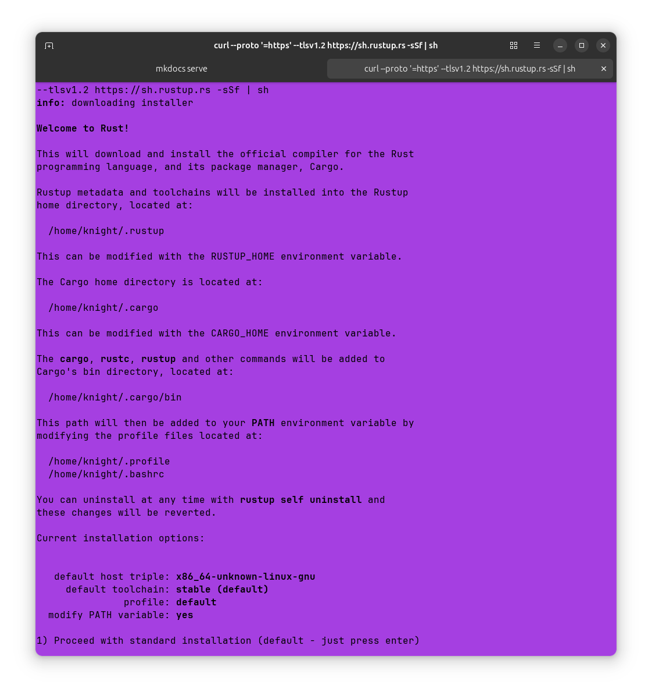
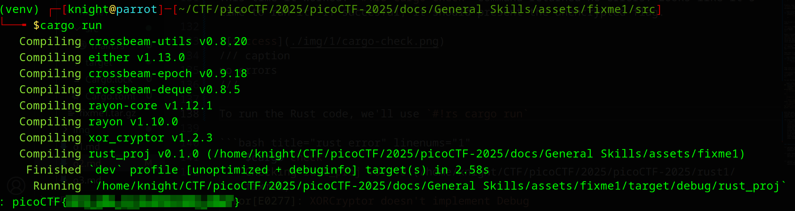

# Rust fixme 1

**Difficulty**: :fontawesome-solid-star::fontawesome-regular-star::fontawesome-regular-star::fontawesome-regular-star::fontawesome-regular-star:<br/>
**Download Rust file**: [Rust fixme 1](./assets/fixme1.tar.gz)

## Objective

!!! question "Description"
    Have you heard of Rust? Fix the syntax errors in this Rust file to print the flag!

## Hints

??? tip "Hint 1"
    Cargo is Rust's package manager and will make your life easier. See the getting started page [here](https://doc.rust-lang.org/book/ch01-03-hello-cargo.html)

??? tip "Hint 2"
    [println!](https://doc.rust-lang.org/std/macro.println.html)

??? tip "Hint 3"
    Rust has some pretty great compiler error messages. Read them maybe?

## Solution

This challenge introduces the Rust programming language and code review. The link in the hints leads to the official documentation for Cargo, Rust's build system and package manager, however I was unfamiliar with Rust. I had to start from the [beginning](https://doc.rust-lang.org/book/ch00-00-introduction.html) and [install](https://doc.rust-lang.org/book/ch01-01-installation.html) Rust before being able to move forward. The steps were straight forward with the `curl` command provided. I also installed a C compiler per the recommendation.<br/>


/// caption
Welcome to Rust
///

With everything installed and a crash course on Rust completed, it's time to attempt the challenge. The code is provided as a .tar.gz to be downloaded. Use `#!bash tar -xvzf fixme1.tar.gz` to extract the `fixme1` directory. Within the `fixme1` directory find `main.rs` located in `src`. I use VSCode and VSCodium to review the code and test changes.

```rs title="fixme1" linenums="1" hl_lines="5 18 25" 
use xor_cryptor::XORCryptor;

fn main() {
    // Key for decryption
    let key = String::from("CSUCKS") // How do we end statements in Rust?

    // Encrypted flag values
    let hex_values = ["41", "30", "20", "63", "4a", "45", "54", "76", "01", "1c", "7e", "59", "63", "e1", "61", "25", "7f", "5a", "60", "50", "11", "38", "1f", "3a", "60", "e9", "62", "20", "0c", "e6", "50", "d3", "35"];

    // Convert the hexadecimal strings to bytes and collect them into a vector
    let encrypted_buffer: Vec<u8> = hex_values.iter()
        .map(|&hex| u8::from_str_radix(hex, 16).unwrap())
        .collect();

    // Create decrpytion object
    let res = XORCryptor::new(&key);
    if res.is_err() {
        ret; // How do we return in rust?
    }
    let xrc = res.unwrap();

    // Decrypt flag and print it out
    let decrypted_buffer = xrc.decrypt_vec(encrypted_buffer);
    println!(
        ":?", // How do we print out a variable in the println function? 
        String::from_utf8_lossy(&decrypted_buffer)
    );
}
```

There are some obvious corrections that need to be made based on the comments. On line 5 we see a question about how to end statements, line 18 ask how to return and line 25 asks how to print a variable. We can also run `cargo check` to see the error output.


/// caption
The errors point to some of the same issues we can assume from the comments
///

We can use the command provided for more information on the error as well as return to the Rust [documentation](https://doc.rust-lang.org/book/ch01-02-hello-world.html). we can find the answer under the heading **Anatomy of a Rust Program**<br/>

`#!rs rustc --explain E0425` tells us that the error is related to "An unresolved name was used." It then offers some code examples to help find where the error might have occured. Checking documentation tells us that most Rust code needs to end in a semicolon, which we can see is missing from line 5 and that the error message further corroberates.


/// caption
Most lines of Rust code end in a semicolon
///


/// caption
The error message is pretty clear on what needs to be fixed here
///

Digging through the  documentation a little more with help of Google searches, I found keyword documentation for [`return`](https://doc.rust-lang.org/std/keyword.return.html). I used a copy/paste version of one of the examples on line 18 to correct the return of the `res` function.

```rust title="Return update" linenums="1" hl_lines="3"
let res = XORCryptor::new(&key);
    if res.is_err() {
        return Err(Error::new(ErrorKind::Other, "XORCryptor error"));
    }
```

Finally, line 25 needs to print a variable. One of the hints provides a link to the `println!` macro where there are some useful examples of using `println!` with a variable. I started with just inserting curly braces `{}`.

```rust title="Printing a variable with println!" linenums="1"
let decrypted_buffer = xrc.decrypt_vec(encrypted_buffer);
    println!(
        ": {}",
    );
```

Time to put it all together. Use `cargo check` to see if all the errors have been fixed. 


/// caption
error E0433
///

Seems I missed something. The use of the error types I copied from the documentation require input of dependencies. In this case `#!rs use std::io::ErrorKind;` & `#!rs use std::io::Error;` were used at the top of the code and were helpfully suggested by the error messages from Rust.<br/>
Turns out though, I was over complicating the issue. Attempting to run the new code still produced an error. 


/// caption
New error E0308
///

This time I received an expected unit type message. Deleting all of my previous attempts, I made the return just parentheses:

```rust title="Updated return" linenums="1" hl_lines="3"
let res = XORCryptor::new(&key);
    if res.is_err() {
        return ();
    }
```

This time it worked! `#!rs cargo check` command returned no errors. Looks like it's time to run it. If succesful, it should present the unencrypted flag.


/// caption
no errors
///

To run the Rust code, we'll use `#!rs cargo run`


/// caption
With the code fixed we can copy our flag
///

!!! note "Code Review & AI"
    I think it is important to note that Large Language Models such as [ChatGPT](https://chatgpt.com/) from [OpenAI](https://openai.com/) and [claude](https://claude.ai/login) from [Anthropic](https://www.anthropic.com/company) can be invaluable tools for code review or learning. Using them for short code review and refactoring can be a massive accelerator to effective code, production and understanding. The caveat is that the user must craft the prompts with these goals in mind. There is an extensive conversation around "AI", it's training and the ethical use thereof, that is beyond the scope of this note, but it is worth being aware of it and to use the tools available to us as hackers. If reading official documentation feels daunting, or a particular aspect is confusing, paste it into a chatAI and ask for a simplified explanation with examples and sources. Use this to augment your skills as you  would any other resource. 

!!! success "Answer"
    Review the provided code, correcting and completing it to execute without error and provide the flag