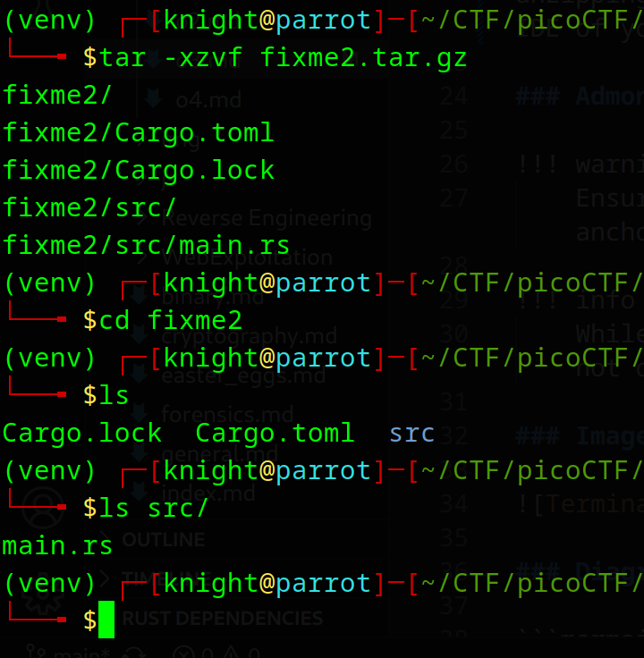
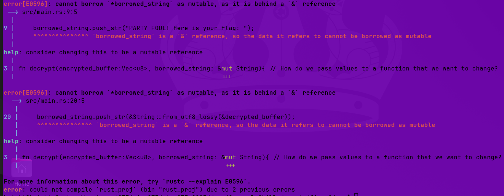
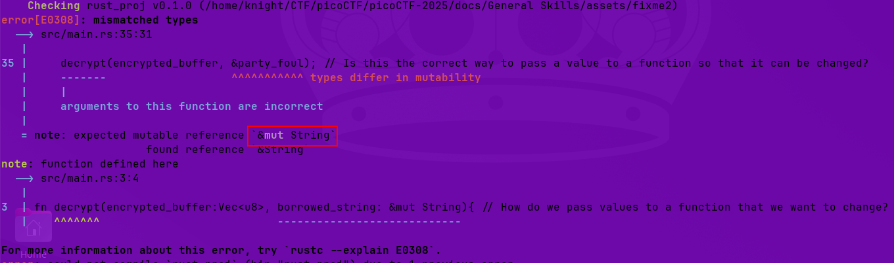
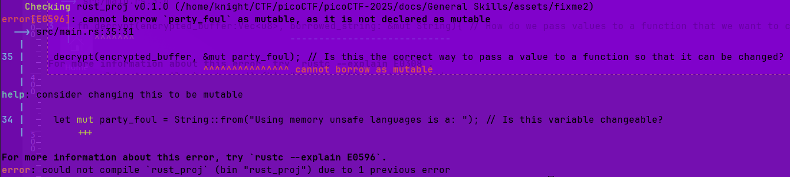
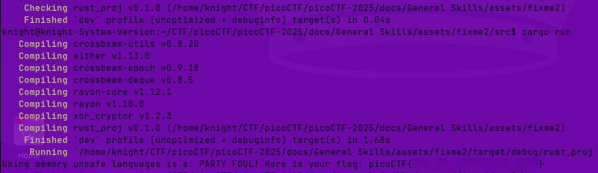

# Rust fixme 2

**Difficulty**: :fontawesome-solid-star::fontawesome-regular-star::fontawesome-regular-star::fontawesome-regular-star::fontawesome-regular-star:<br/>
**Download Rust file**: [Rust fixme 2](./assets/fixme2.tar.gz)

## Objective

!!! question "Description"
    The Rust saga continues? I ask you, can I borrow that, pleeeeeaaaasseeeee?

## Hints

??? tip "Hint 1"
    https://doc.rust-lang.org/book/ch04-02-references-and-borrowing.html

## Solution

Similar to [fixme1](./o2.md) this challenge presents us with a zipped Rust file to review and correct. We'll start the same as before, downloading the file and unzipping with `tar -xzvf fixme2.tar.gz` and then `cd fixme2`. Open `main.rs` with an IDE of your choice; I use VSCode and VSCodium for this write up.


/// caption
Unzip and navigate to `main.rs`
///

Opening `main.rs` we can review our new code:

```rust title="fixme 2 main.rs" linenums="1" hl_lines="3 15 37-38"
use xor_cryptor::XORCryptor;

fn decrypt(encrypted_buffer:Vec<u8>, borrowed_string: &String){ 
    // How do we pass values to a function that we want to change?

    // Key for decryption
    let key = String::from("CSUCKS");

    // Editing our borrowed value
    borrowed_string.push_str("PARTY FOUL! Here is your flag: ");

    // Create decrpytion object
    let res = XORCryptor::new(&key);
    if res.is_err() {
        return; // How do we return in rust?
    }
    let xrc = res.unwrap();

    // Decrypt flag and print it out
    let decrypted_buffer = xrc.decrypt_vec(encrypted_buffer);
    borrowed_string.push_str(&String::from_utf8_lossy(&decrypted_buffer));
    println!("{}", borrowed_string);
}

fn main() {
    // Encrypted flag values
    let hex_values = ["41", "30", "20", "63", "4a", "45", "54", "76", "01", "1c",
     "7e", "59", "63", "e1", "61", "25", "0d", "c4", "60", "f2", "12", "a0", "18",
     "03", "51", "03", "36", "05", "0e", "f9", "42", "5b"];

    // Convert the hexadecimal strings to bytes and collect them into a vector
    let encrypted_buffer: Vec<u8> = hex_values.iter()
        .map(|&hex| u8::from_str_radix(hex, 16).unwrap())
        .collect();

    let party_foul = String::from("Using memory unsafe languages is a: "); // Is this variable changeable?
    decrypt(encrypted_buffer, &party_foul); // Is this the correct way to pass a value to a function so that it can be changed?
}
```

!!! note "fixme 1"
    It is assumed that you have completed the [fixme1](./o2.md) challenge prior to fixme2. As such, this challenge builds off of the previous.

The comments provide some prompts to begin our review starting on line 3 "How do we pass values to a function that we want to change?". The hint for this challenge is a link to the Rust documentation, specifically chapter 4.2 discussing "References and Borrowing". It's also helpful to use the `cargo check` command.


/// caption
error E0596
///

Not only does Rust have useful error messages, but more importantly, they come with suggestions for correction. Following the suggestions, make the `&String` mutable by adding `&mut` as shown in the help text.<br/>
<br/>
We'll need to make the changes at line 3 so it looks like the snippet below. While we are editing, I went ahead and added the parentheses `()` to line 14 which we learned during the previous challenge. 

```rust title="Mutable change" 
// line 3
fn decrypt(encrypted_buffer:Vec<u8>, borrowed_string: &mut String){

/// line 14
return ();
```

Taking a methodical approach, save the file and run `cargo check` again. This time we get `#!rs error[E0308]: mismatched types`. The error points to the error happening on line 35, tells us what the expectation is, and tells us where the function was defined. 


/// caption
error E308
///

Using the suggested change, I tried to add `&mut` to line 35 so it looks like this:

```rust title="Correct mismatched types" 
decrypt(encrypted_buffer, &mut party_foul);
```

Run `cargo check` again to see an error for line 34


/// caption
error E0596 and a suggestion for the fix
///

Update line 34 to match the help suggestion

```rust title="Declare mutable"
let mut party_foul = String::from("Using memory unsafe languages is a: ");
```

Run `cargo check` one more time to confirm that there are no more errors, then execute the code with `cargo run`. 


/// caption
Party Foul
///

!!! success "Answer"
    Use Rust's error responses to correct the code and decrypt the flag.