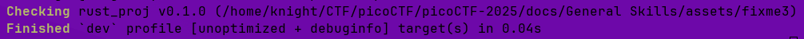

# Rust fixme 3

**Difficulty**: :fontawesome-solid-star::fontawesome-regular-star::fontawesome-regular-star::fontawesome-regular-star::fontawesome-regular-star:<br/>
**Download Rust file**: [Rust fixme 3](./assets/fixme3.tar.gz)

## Objective

!!! question "Description"
    Have you heard of Rust? Fix the syntax errors in this Rust file to print the flag!

## Hints

??? tip "Hint 1"
    Read the comments...darn it!

## Solution

This is the final installment of the Rust Fixme challenges. It starts like [fixme1](./o2.md) and [fixme2](./o3.md); we'll download the zipped source code, unzip it, open it in a code editor, and run `cargo check` to see what we are working with.

```rust title="Initial code" linenums="1" hl_lines="22 34"
use xor_cryptor::XORCryptor;

fn decrypt(encrypted_buffer: Vec<u8>, borrowed_string: &mut String) {
    // Key for decryption
    let key = String::from("CSUCKS");

    // Editing our borrowed value
    borrowed_string.push_str("PARTY FOUL! Here is your flag: ");

    // Create decryption object
    let res = XORCryptor::new(&key);
    if res.is_err() {
        return;
    }
    let xrc = res.unwrap();

    // Did you know you have to do "unsafe operations in Rust?
    // https://doc.rust-lang.org/book/ch19-01-unsafe-rust.html
    // Even though we have these memory safe languages, sometimes we need to do things outside of the rules
    // This is where unsafe rust comes in, something that is important to know about in order to keep things in perspective
    
    // unsafe {
        // Decrypt the flag operations 
        let decrypted_buffer = xrc.decrypt_vec(encrypted_buffer);

        // Creating a pointer 
        let decrypted_ptr = decrypted_buffer.as_ptr();
        let decrypted_len = decrypted_buffer.len();
        
        // Unsafe operation: calling an unsafe function that dereferences a raw pointer
        let decrypted_slice = std::slice::from_raw_parts(decrypted_ptr, decrypted_len);

        borrowed_string.push_str(&String::from_utf8_lossy(decrypted_slice));
    // }
    println!("{}", borrowed_string);
}

fn main() {
    // Encrypted flag values
    let hex_values = ["41", "30", "20", "63", "4a", "45", "54", "76", "12", "90", "7e", "53", "63", "e1", "01", "35", "7e", "59", "60", "f6", "03", "86", "7f", "56", "41", "29", "30", "6f", "08", "c3", "61", "f9", "35"];

    // Convert the hexadecimal strings to bytes and collect them into a vector
    let encrypted_buffer: Vec<u8> = hex_values.iter()
        .map(|&hex| u8::from_str_radix(hex, 16).unwrap())
        .collect();

    let mut party_foul = String::from("Using memory unsafe languages is a: ");
    decrypt(encrypted_buffer, &mut party_foul);
}
```


/// caption
error E1033
///

As seen above, the code builds off the previous two versions and added some comments to point us in the right direction, including another chapter of the Rust [documentation](https://doc.rust-lang.org/book/ch19-01-unsafe-rust.html) that discusses "unsafe rust" and the use thereof.

!!! quote "Unsafe Rust"
    Rust has a second language hidden inside it that doesn’t enforce these memory safety guarantees: it’s called unsafe Rust and works just like regular Rust, but gives us extra superpowers.

Unsafe Rust has five main actions, called *unsafe superpowers* in the documentation, that allow you to access the five features that are not checked by the compiler for memory safety, allowing a programmer to tell the compiler that the code is safe. It also allows the programmer to interact directly with the operating system or write their own os. 

!!! warning "Risks"
    If you use unsafe code incorrectly, problems can occur due to memory unsafety, such as null pointer dereferencing

Be sure to read the rest of [chapter 20.1](https://doc.rust-lang.org/book/ch20-01-unsafe-rust.html) to get a deeper understanding of unsafe Rust and its uses.<br/>
Taking a hint from the previous challenges, I started my code editing by just removing the comments at lines 22 and 34.<br/>


/// caption
The check was successful
///

That's promissing. Lets run it with the `cargo run` command to get the flag.


/// caption
Now we can call ourselves Rustaceans :laughing:
///

!!! success "Answer"
    Implement unsafe Rust to retrieve the flag
