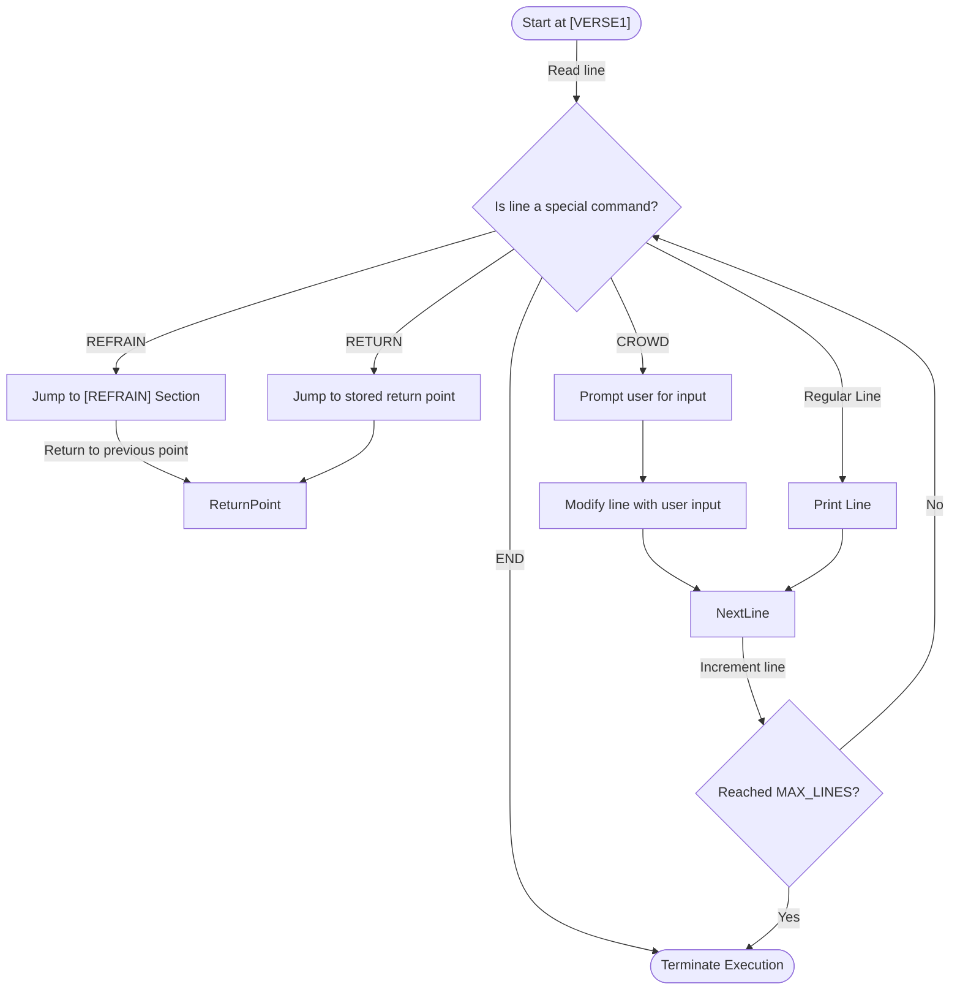
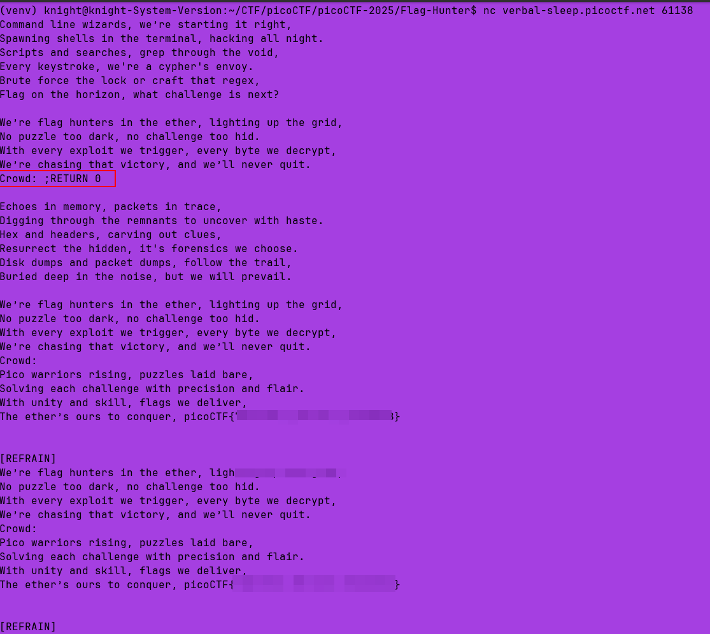

# Flag Hunters

**Difficulty**: :fontawesome-solid-star::fontawesome-regular-star::fontawesome-regular-star::fontawesome-regular-star::fontawesome-regular-star:<br/>
**Direct connect with `netcat`**: `nc verbal-sleep.picoctf.net 61138`
**Download source**[Source](./assets/lyric-reader.py)

## Objective

!!! question "Description"
    Lyrics jump from verses to the refrain kind of like a subroutine call. There's a hidden refrain this program doesn't print by default. Can you get it to print it? There might be something in it for you.

## Hints

??? tip "Hint 1"
    This program can easily get into undefined states. Don't be shy about Ctrl-C.

??? tip "Hint 2"
    Unsanitized user input is always good, right?

??? tip "Hint 3"
    Is there any syntax that is ripe for subversion?

## Solution

Lets start with checking the source code. Looks like we can execute the code locally if we have a `flag.txt` file in the same directory. Use `echo` to create the file with something similar to the command below. Be sure you are in the same directory that `lyric-reader.py` is in:

```bash title="Make flag.txt" 
echo "picoCTF{dummy_flag_here}" > flag.txt
```

Analyzing the code, there are some things to take note of:

  1.    Loads the flag from `flag.txt` and embeds it in the 'secret intro' section
  2.    `reader` function processes lyrics with specific control characters:
    -   `REFRAIN` jumps to the refrain section
    -   `RETURN` jumps back to where the `REFRAIN` was called from
    -   `CROWD` prompts for user input
    -   `END` terminates execution

Based on the hints, we are looking for unsanitized input vulnerability. That would imply that the specific piece of vulnerable code is:

```python title="Vulnerability" linenums="117"
elif re.match(r"CROWD.*", line):
    crowd = input('Crowd: ')
    song_lines[lip] = 'Crowd: ' + crowd
```

Something that we don't actually see happening anywhere is the secret verse getting called. It is assigned to the variable `secret_intro` and concatanated with `flag` in lines 8-13: 

```python title="secret_intro variable" linenums="8"
secret_intro = \
'''Pico warriors rising, puzzles laid bare,
Solving each challenge with precision and flair.
With unity and skill, flags we deliver,
The ether’s ours to conquer, '''\
+ flag + '\n'
```

and it is referenced on line 16 when assigned to the variable `song_flag_hunters`:

```python title="song_flag_hunters variable" linenums="16"
song_flag_hunters = secret_intro +\
```

When looking at how the `reader` function is built, it takes two arguments; `#!py3 def reader(song, startLabel):`. The function expects the first input to be the song, which is "song_flag_hunters" here and the second input to be the **startLabel**. When the `reader` function is called with `#!py reader(song_flag_hunters, '[VERSE1]')` **[VERSE1]** is provided as the second argument, meaning our **startLabel** variable is assigned as **[VERSE1]**. Mapping the code visually can be helpful to understand what it is designed to do before trying to manipulate it's flow.



Now we have a visual flowchart of the source code. We can execute the source code locally to start testing payloads and getting a feel for the responses.<br/>

!!! note "Local vs Remote"
    It will be much easier to test your theories locally, then apply them to the `netcat` service to obtain the actual flag.

With the `flag.txt` file in the same directory, try executing the `lyric-reader.py` locally. 

```bash title="Local execution" linenums="1"
# Make the program executable
chmod +x lyric-reader.py

# execute the program
python lyric-reader.py
```

Start using various input attempts to inject a command that will redirect execution to the beginning of the song, before VERSE1.<br/>
<br/>
Personally, it took me a while to figure out the correct payload syntax that is needed. I eventually used the debug feature of VS Code to set up breaks in the code and track the values of the different variables. I also commented out line 127 `#!py time.sleep(0.5)` so as to not have to wait. Eventually, I was able to find the correct payload:<br/>

```bash title="Payload"
;RETURN 0
```

The pain-points I ran into was spaces. The semicolon(;) is critical, since the program splits lines on semicolons and process each part separately. However, I found out it is just as critical to have the spacing correct. If there is a space between the semicolon and the start of the return, it will not work.<br/>

!!! success "Answer"
    Connect to the service using `netcat`. When prompted, enter `;RETURN 0` to view the secret intro.<br/>
    
