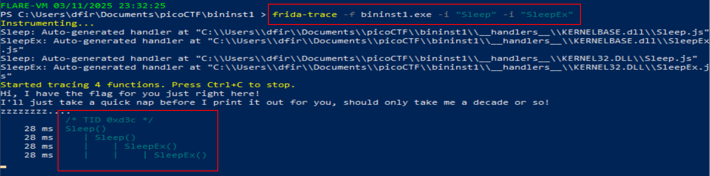

# Binary Instrumentation 1

**Difficulty**: :fontawesome-solid-star::fontawesome-solid-star::fontawesome-regular-star::fontawesome-regular-star::fontawesome-regular-star:<br/>
**Direct link**: [Executable](./assets/bininst1.zip). Use the password `picoctf` to unzip

## Objective

!!! question "Description"
    I have been learning to use the Windows API to do cool stuff! Can you wake up my program to get the flag?

## Hints

??? tip "Hint 1"
    Frida is an easy-to-install, lightweight binary instrumentation toolkit

??? tip "Hint 2"
    Try using the CLI tools like frida-trace to auto-generate handlers

## Solution

This challenge starts by providing a compressed Windows executable, along with hints of to use a tool called `frida`. According to their website [frida](https://frida.re/) is a "Dynamic instrumentation toolkit for developers, reverse-engineers, and security researchers." It can quickly and easily be installed with `pip` using `#!bash pip install frida-tools`. Read more about Frida, use cases, and functions from the [documentation](https://frida.re/docs/home/). I also spun up a reverse engineering specific Windows VM. You can read more about FLARE-VM and install your own from the [mandiant GitHub](https://github.com/mandiant/flare-vm). This write-up will be using PowerShell when executing Frida and the challenge executable.<br/>

!!! warning "Tools & VMs"
    Just like the use of virtual environments is a good habit to get into; it is well advised to use virtual machines for things like forensics and reverse engineering. There are a number of valid reasons for keeping these machines seperate, and using the right one for the job, not the least of which is isolation. 

Where ever you choose to do your work, download the .zip file and unzip or extract the file. Then use Frida to execute the `bininst1.exe` file. From a Windows computer:

    1.  Open PowerShell
        1.  Use ++"Win"++ + ++"R"++ to open "Run"
        2.  type "powershell" and press ++"Enter"++
    2.  Navigate to the directory that `bininst1.exe` was extracted to
    3.  Initiate `frida-trace` to execute the file
        1.  `frida-trace -f bininst1.exe`


/// caption
We don't have that kind of time to be waiting
///

Lets check for any sleep-related function calls in the program. If we find them, we can intercept and modify the calls. Use `frida-trace` from the command line again, this time using `-i` to tell `frida` to include the "Sleep" and "SleepEx" functions:

```powershell linenums="1" title="CLI"
frida-trace -f bininst1.exe -i "Sleep" -i "SleepEx"
```


/// caption
This shows both functions being used.
///

With the functions known, we can write a `hook.js` script that Frida can inject into the program as it is executing. In this case, we need to "hook" the `Sleep` and `SleepEx` functions and modify them. <br/>

```javascript title="hook.js"
Interceptor.attach(Module.getExportByName(null, 'Sleep'), {
    onEnter: function(args) {
        console.log('[+] Sleep called with: ' + args[0] + ' milliseconds');
        args[0] = ptr('0'); // Changes sleep time to 0
        console.log('[+] Modified Sleep duration to: 0 milliseconds');
    }
  });

  Interceptor.attach(Module.getExportByName(null, 'SleepEx'), {
    onEnter: function(args) {
        console.log('[+] SleepEx called with: ' + args[0] + ' milliseconds');
        args[0] = ptr('0'); // Changes sleep time to 0
        console.log('[+] Modified SleepEx duration to: 0 milliseconds');
    }
  });

  console.log("[+] Sleep hooks installed. Running program with bypassed sleep...");
```

```powershell title="Using `hook.js`"
frida -f bininst1.exe -l hooks.js
```


/// caption
The flage is given in base64, which can be copy and pasted to [CyberChef](https://gchq.github.io/CyberChef/)
///

!!! success "Answer"
    Use the Frida tool to investigate and modify an executable
