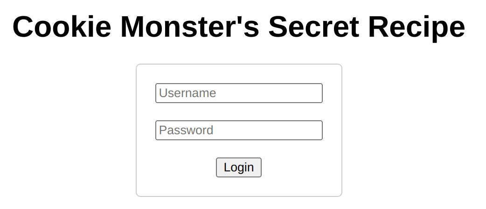
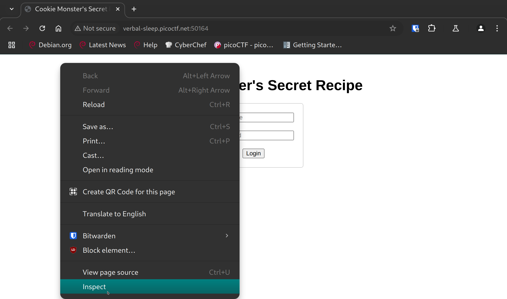
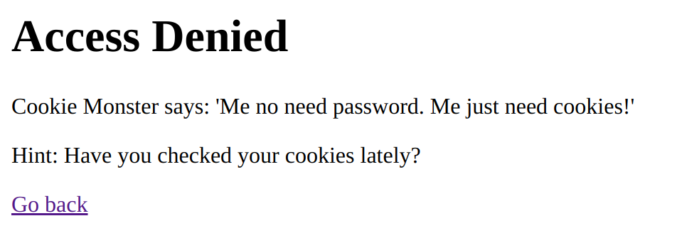
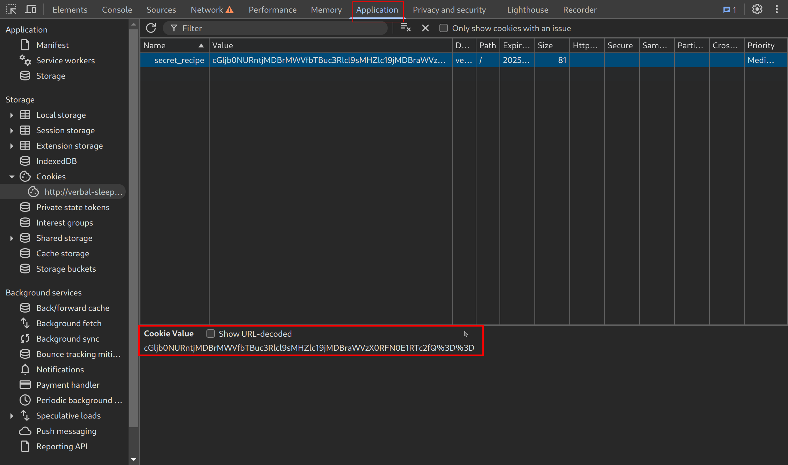
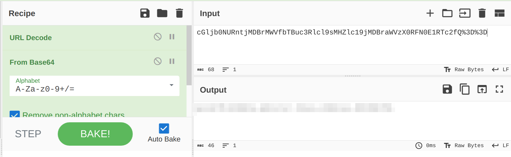

# Cookie Monster Secret Recipe

/// caption
///

**Difficulty**: :fontawesome-solid-star::fontawesome-regular-star::fontawesome-regular-star::fontawesome-regular-star::fontawesome-regular-star: 
**Direct link**: [Secret Recipe Login](http://verbal-sleep.picoctf.net:50164/)

## Objective

!!! question "Description"
    Cookie Monster has hidden his top-secret cookie recipe somewhere on his website. As an aspiring cookie detective, your mission is to uncover this delectable secret. Can you outsmart Cookie Monster and find the hidden recipe?

## Hints

??? tip "Hint 1"
    Sometimes, the most important information is hidden in plain sight. Have you checked all parts of the webpage?

??? tip "Hint 2"
    Cookies aren't just for eating - they're also used in web technologies!

??? tip "Hint 3"
    Web browsers often have tools that can help you inspect various aspects of a webpage, including things you can't see directly.

## Solution

Start by navigating to the website provided, where we see a login page. 

/// caption
login page
///

!!! info "Browser Choice"
    This challenge focuses on the Developer Tools that most browsers have. Different browsers have both different layouts, as well as different tools, although the major points are often universal. I use Chromium in this challenge but any browser should be sufficient, just be aware that the layout may be different.

Open up the Developer Tools with ++"F12"++ or righ-click -> Inspect. 

/// caption
F12 to inspect Dev Tools
///

Dev Tools will often open in a split screen. Once Developer Tools is open, I tried a basic login with `admin:admin` to see what results would show up. The first thing is the "Access Denied" page. 

/// caption
Access Denied
///

So logging in isn't the goal, but checking the output in Dev Tools shows us where we need to go next. In Dev Tools, select "Application" then highlight cookie labeled "secret recipe". 

/// caption
Highlight the secret recipe to view the cookie
///

The cookie looks to be encoded. Copy and paste it into something like [CyberChef](https://cyberchef.org/) to decode it. Grab the cookie, paste it in the input field to decode your flag. 

/// caption
use a tool like CyberChef to get the flag
///

!!! success "Answer"
    Use Developer Tools to find the cookie.
