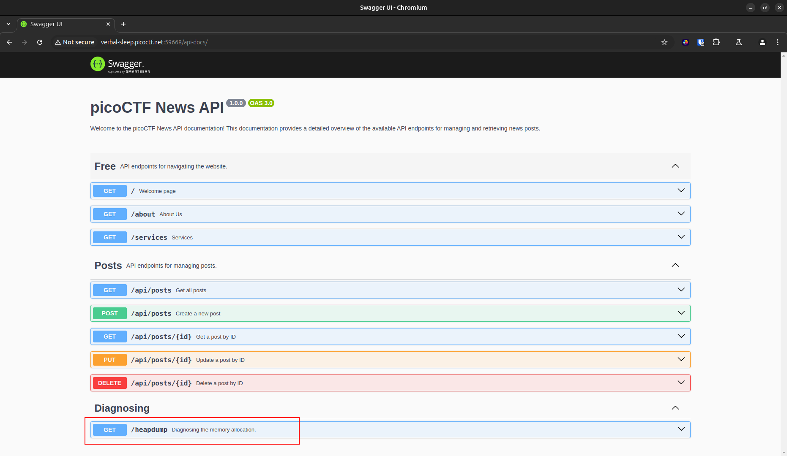
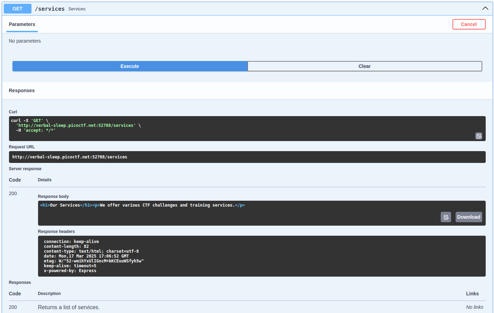
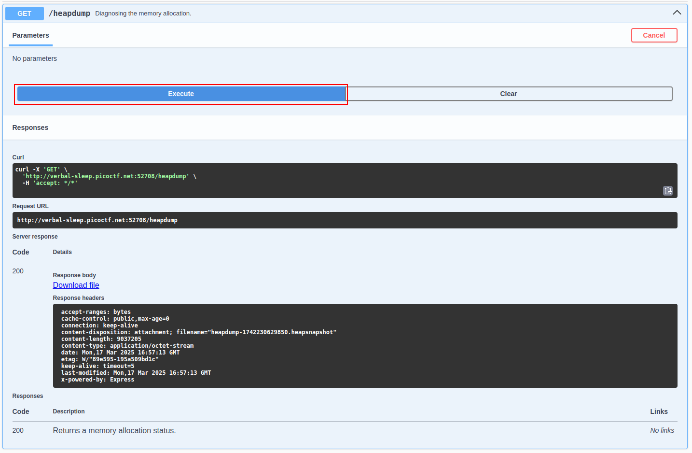

# head-dump

**Difficulty**: :fontawesome-solid-star::fontawesome-regular-star::fontawesome-regular-star::fontawesome-regular-star::fontawesome-regular-star:<br/>


## Objective

!!! question "Description"
    Welcome to the challenge! In this challenge, you will explore a web application and find an endpoint that exposes a file containing a hidden flag.<br/>
    The application is a simple blog website where you can read articles about various topics, including an article about API Documentation. Your goal is to explore the application and find the endpoint that generates files holding the server’s memory, where a secret flag is hidden.<br/>

## Hints

??? tip "Hint 1"
    Explore backend development with us

??? tip "Hint 2"
    The head was dumped.

## Solution

To begin the challenge, start the instance and open the link provided. You'll be taken to the blog *picoCTF* to start exploring. 


/// caption
Landing page has a few interactive links to click through
///

I started with just poking around, exploring the various links available. Turns out that only the link "**#API Documentation**" is a live link and takes us to the *picoCTF News API*. 


/// caption
The last category looks promising based on our clues and challenge title...
///

We are able to expand each of the dropdown arrouws to view the parameter involved, and test out the function. Doing so produces a response with multiple ways of collecting the information provided. You can poke around getting a feel for the endpoint, as well as download the responses provided.


/// caption
After using the ++"Try it out"++ ++"Execute"++ button use one of the provided methods to collect the output. A `curl` command, a request URL, and a ++"Download"++ button are avaialable.
///

At the bottom of the options we find `/heapdump` which produces a `.heapdump` file. Download the file using one of the methods listed. 


/// caption
Download the `.heapsnapshot` file after executing.
///

With the file downloaded, use Linux Fu to extract your flag.

```py title="Heapdump flag extraction" 
strings heapdump.heapsnapshot |grep "picoCTF{"
```

!!! success "Answer"
    Download the heapdump and extract the flag with Linux commands.
