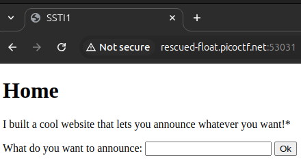
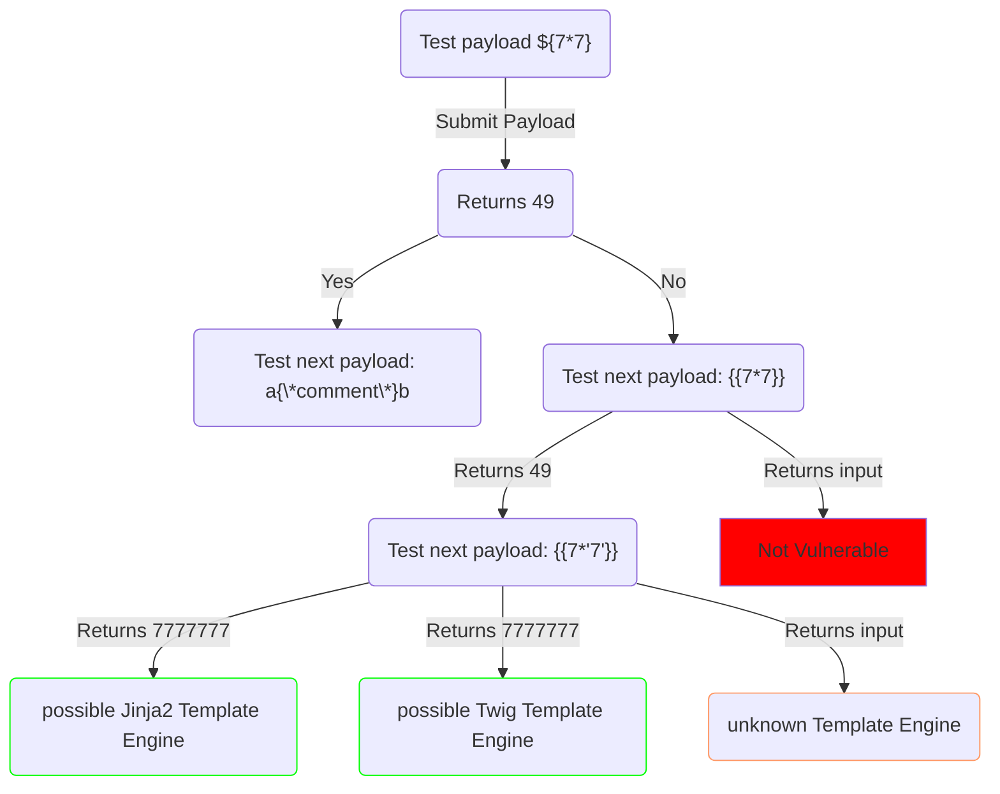
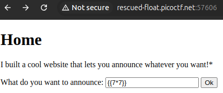
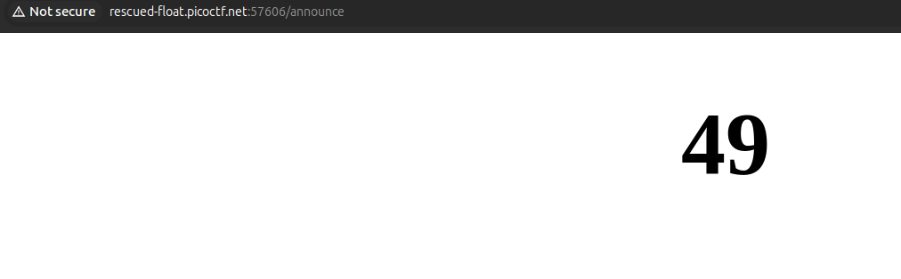
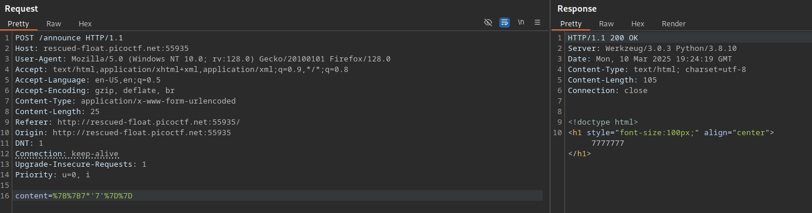
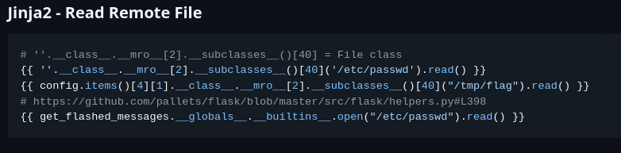
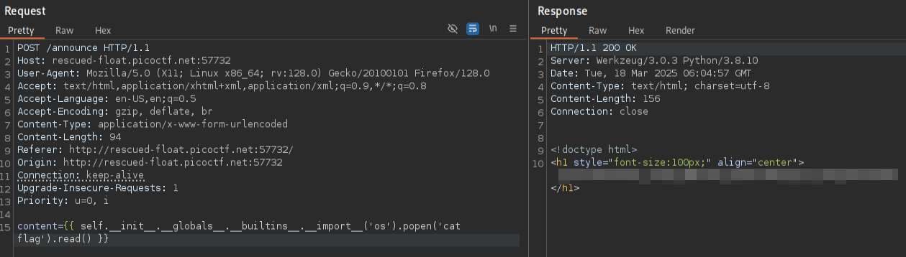

# SSTI 1

**Difficulty**: :fontawesome-solid-star::fontawesome-solid-star::fontawesome-regular-star::fontawesome-regular-star::fontawesome-regular-star:<br/>

## Objective

!!! question "Request"
    I made a cool website where you can announce whatever you want! Try it out!<br/>
    I heard templating is a cool and modular way to build web apps! Check out my website <br/>

## Hints

??? tip "Hint 1"
    Server Side Template Injection

## Solution

This challenge gave us the attack vector in the hint: "Server Side Template Injection". Looking once again at [PayloadsAllTheThings](https://github.com/swisskyrepo/PayloadsAllTheThings.git) there is a [Server Side Template Injection](https://github.com/swisskyrepo/PayloadsAllTheThings/tree/master/Server%20Side%20Template%20Injection) directory. One of the really helpful aspects of this resource is the break down offered for many of the vulnerabilities. Under *Server Side Template Injection* I read up about the methodology for Server Side Template Injection.<br/>
Typically, it would be necessary to first search for and identify the vulnerable input field(s) but for this challenge there is just the one option when we navigate to the provided instance.


/// caption
With only one input field, it is only a matter of crafting the appropriate payload.
///

With the vulnerability and target input field already provided, the next step is to enumerate the template engine used by the server. There are a few different ways that this can be done, once an attacker has determined that a site is vulnerable. The [Hackmanit/Template Injection Table](https://cheatsheet.hackmanit.de/template-injection-table/) has an interactive table containing helpful template injection polyglots along with the expected responses of some of the most used template engines.<br/>
<br/>
In order to enumerate the template engine, we send various polyglots to review the response through the identified attack field. This can be done manually, through the field on the site, or with the use of a tool such as BurpSuite Community. The chart below shows the initial enumeration path I took to get an idea of the framework being used.




/// caption
Manual testing the input field
///


/// caption
test result
///


/// caption
7777777
///

Once the template engine is determined, we can return to [PayloadsAllTheThings](https://github.com/swisskyrepo/PayloadsAllTheThings.git) and the [Server Side Template Injection](https://github.com/swisskyrepo/PayloadsAllTheThings/blob/master/Server%20Side%20Template%20Injection/Python.md) folder to find a list of payloads that can be used for the various payloads. I determined that the template engine being used is **Jinja2** which uses the Python language. Checking the available payloads, there's a promising heading `Jinja2 - Read Remote File`. 


/// caption
Read Remote File payloads
///

Making adjustments for possible flag locations, I used BurpSuite Intruder to test various payloads.

```py title="Potential SSTI Payloads" linenums="1"
# ''.__class__.__mro__[2].__subclasses__()[40] = File class
{{ ''.__class__.__mro__[2].__subclasses__()[40]('flag').read() }}
{{ config.items()[4][1].__class__.__mro__[2].__subclasses__()[40]("flag").read() }}
# https://github.com/pallets/flask/blob/master/src/flask/helpers.py#L398
{{ get_flashed_messages.__globals__.__builtins__.open("flag").read() }}
```


/// caption
Use BurpSuite to send the payload to read the flag
///

!!! success "Answer"
    Find the right payload to recover the flag.<br/>
    `#!py {{ self.__init__.__globals__.__builtins__.__import__('os').popen('cat flag').read() }}`