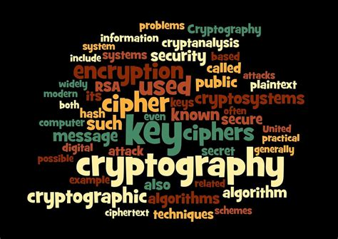
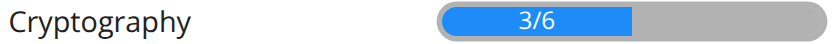

# Welcome

 Welcome to my write-ups for the 2025 picoCTF Cryptography category. I was able to complete three of the six challenges during the challenge window and document them in the following walk-throughs. 
This CTF is divided into six categories; [Web Exploitation](./webexploit.md), [Cryptography](./cryptography.md), [Reverse Engineering](./reverse.md), [Forensics](./forensics.md), [General Skills](./general.md), and [Binary Exploitation](./binary.md). You can follow the links to the other categories or the links below to the challenges I was able to complete before the end of the competition. 

??? tip "Navigation tip"
    Depending on the write up, there can be quite a bit of information to read through. To make things a little easier, you can use ++"P"++ or ++","++ to go to the previous section, ++"N"++ or ++"."++ to navigate to the next section, and ++"S"++, ++"F"++, or ++"/"++ to open up the search dialog.

    **TL;DR** if you keep pressing ++"N"++ or ++"."++ from this point forward, you'll hit all the content in the right order! :smile:

## Answers

!!! success "1. hashcrack - :fontawesome-solid-star::fontawesome-regular-star::fontawesome-regular-star::fontawesome-regular-star::fontawesome-regular-star:"
    Use online cracking tools to find the [hashed passwords](./Cryptography/o1.md).

!!! success "2. EVEN RSA CAN BE BROKEN??? - :fontawesome-solid-star::fontawesome-solid-star::fontawesome-regular-star::fontawesome-regular-star::fontawesome-regular-star:"
    Crack the [RSA](./Cryptography/o2.md) encryption by comparing `N` values to find shared primes.

!!! success "3. Guess My Cheese (Part 1) - :fontawesome-solid-star::fontawesome-solid-star::fontawesome-regular-star::fontawesome-regular-star::fontawesome-regular-star:"
    Discover the [secret cheese](./Cryptography/o3.md) and Affine Ciphers.
