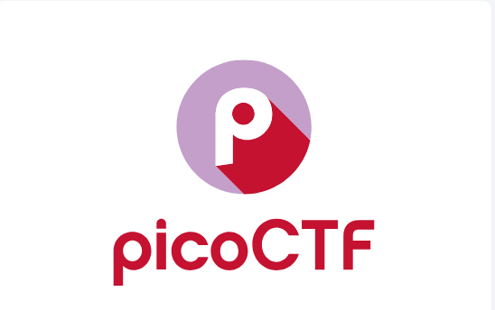

# Welcome

 

## Introduction

Welcome to my write-ups covering the **General Skills** challenges of the 2025 picoCTF. During the initial challenge I completed the four challenges below. The first, FANTASY CTF, was an introductory challenge covering the rules and picoCTF platform. The remaining three were an introduction to the Rust programming language. They gave challengers an opportunity to practice code review and documentation reading, which was a good experience for me. 
This CTF is divided into six categories; [Web Exploitation](./webexploit.md), [Cryptography](./cryptography.md), [Reverse Engineering](./reverse.md), [Forensics](./forensics.md), [General Skills](./general.md), and [Binary Exploitation](./binary.md). You can follow the links to the other categories or the links below to the challenges I was able to complete before the end of the competition. 

??? tip "Navigation tip"
    Depending on the write up, there can be quite a bit of information to read through. To make things a little easier, you can use ++"P"++ or ++","++ to go to the previous section, ++"N"++ or ++"."++ to navigate to the next section, and ++"S"++, ++"F"++, or ++"/"++ to open up the search dialog.

    **TL;DR** if you keep pressing ++"N"++ or ++"."++ from this point forward, you'll hit all the content in the right order! :smile:

## Answers

!!! success "FANTASY CTF - :fontawesome-solid-star::fontawesome-regular-star::fontawesome-regular-star::fontawesome-regular-star::fontawesome-regular-star:"
    Follow along the prompts in the [fantasy game](./General Skills/o1.md) for an interactive introduction to the rules and platform.

!!! success "Rust fixme 1 - :fontawesome-solid-star::fontawesome-regular-star::fontawesome-regular-star::fontawesome-regular-star::fontawesome-regular-star:"
    Learn Rust basics reviewing the [code](./General Skills/o2.md) and correcting it.

!!! success "Rust fixme 2 - :fontawesome-solid-star::fontawesome-regular-star::fontawesome-regular-star::fontawesome-regular-star::fontawesome-regular-star:"
    Use [references and borrowing](./General Skills/o3.md) to correct the code.

!!! success "Rust fixme 3 - :fontawesome-solid-star::fontawesome-regular-star::fontawesome-regular-star::fontawesome-regular-star::fontawesome-regular-star:"
    Using code review skills and documentation for [unsafe Rust](./General Skills/o4.md) to retrieve the decrypted flag.