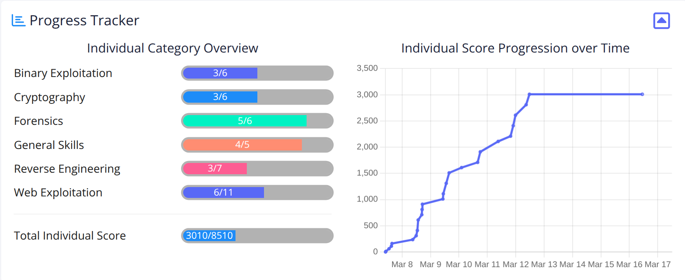

# Welcome

/// caption
///

## Introduction

This is my first time competing with picoCTF. While I did not do as well as I had hoped, I completed more than half of the challenges, identified areas where I need to dive deeper, as well as areas in which I have improved since begginning my cyber security journey. 
 
This CTF is divided into six categories: [Web Exploitation](./webexploit.md), [Cryptography](./cryptography.md), [Reverse Engineering](./reverse.md), [Forensics](./forensics.md), [General Skills](./general.md), and [Binary Exploitation](./binary.md) with each challenge within the categories being assigned a number of points based on it's level of complication. Most challenges were increments of 100 points (100, 200, 300, 400, & 500) though not each category had the same level of challenges. For example, the Forensics and Cryptography categories each have 6 challenges, however Forensics is worth a total of 950 points for all solved challenges while Cryptography is worth 1700 points if all challenges are solved. 

??? tip "Navigation tip"
    Depending on the write up, there can be quite a bit of information to read through. To make things a little easier, you can use ++"P"++ or ++","++ to go to the previous section, ++"N"++ or ++"."++ to navigate to the next section, and ++"S"++, ++"F"++, or ++"/"++ to open up the search dialog.

    **TL;DR** if you keep pressing ++"N"++ or ++"."++ from this point forward, you'll hit all the content in the right order! :smile:

## Answers

!!! success "General Skills - :fontawesome-solid-star::fontawesome-solid-star::fontawesome-regular-star::fontawesome-regular-star::fontawesome-regular-star:"
    [General Skills](general.md) write-ups.
    
!!! success "Web Exploitation - :fontawesome-solid-star::fontawesome-solid-star::fontawesome-regular-star::fontawesome-regular-star::fontawesome-regular-star:"
    [Web Exploitation](webexploit.md) write-ups.

!!! success "Cryptography - :fontawesome-solid-star::fontawesome-solid-star::fontawesome-regular-star::fontawesome-regular-star::fontawesome-regular-star:"
    [Cryptography](cryptography.md) write-ups.

!!! success "Reverse Engineering - :fontawesome-solid-star::fontawesome-solid-star::fontawesome-regular-star::fontawesome-regular-star::fontawesome-regular-star:"
    [Reverse Engineering](reverse.md) write-ups.

!!! success "Forensics - :fontawesome-solid-star::fontawesome-solid-star::fontawesome-regular-star::fontawesome-regular-star::fontawesome-regular-star:"
    [Forensics](forensics.md) write-ups.

!!! success "Binary Exploitation - :fontawesome-solid-star::fontawesome-solid-star::fontawesome-regular-star::fontawesome-regular-star::fontawesome-regular-star:"
    [Binary Exploitation](binary.md) write-ups.

## Conclusion

Overall, this event was fun. I was really able to improve a lot of the fundamental skills I've been trying to develop, try out new things, and highlight areas I need further growth and focus in. I'm definitely looking forward to next one.

